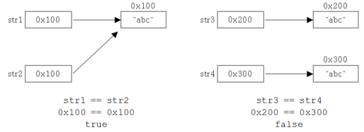

# String 클래스

* 기존의 다른 언어에서는 문자열을 char형의 배열로 다루었으나 자바에서는 문자열을 위한 String 클래스를 제공한다.  
  String 클래스는 문자열을 저장하고 이를 다루는데 필요한 메소드를 함께 제공한다.

## 변경 불가능한(immutable) 클래스

* String 클래스에는 문자열을 저장하기 위해서 문자형 배열 참조변수 value를 인스턴스 변수로 정의해놓고 있다.  
  인스턴스 생성 시 생성자의 매개변수로 입력받는 문자열은 이 인스턴스 변수(value)에 문자형 배열(char[])로 저장되는 것이다.

```java
public final class String implements java.io.Serializable, Comparable<String>, CharSequence {
    private final char value[];
    ...
}
```

* 한번 생성된 String 인스턴스가 갖고 있는 문자열은 읽어 올 수만 있고, 변경할 수는 없다.

* '+' 연산자를 이용해서 문자열을 결합하는 경우 인스턴스 내의 문자열이 바뀌는 것이 아니라  
  새로운 문자열("ab")이 담긴 String 인스턴스가 생성되는 것이다.
  
```java
class Example {
    public static void main(String[] args) {
        String a = "a";
        String b = "b";

        System.out.println(a);
        System.out.println(System.identityHashCode(a));
        System.out.println(System.identityHashCode(b));

        a = a + b;

        System.out.println(a);
        System.out.println(System.identityHashCode(a));
        System.out.println(System.identityHashCode(b));
    }
}
```

```
a
1404928347
604107971
ab
123961122
604107971
```

* 이처럼 덧셈 연산자 '+'를 사용해서 문자열을 결합하는 것은 매 연산 시마다 새로운 문자열을 가진  
  String 인스턴스가 생성되어 메모리 공간을 차지하게 되므로 가능한 결합횟수를 줄이는 것이 좋다.
  
* 문자열간의 결합이나 추출 등 문자열을 다루는 작업이 많이 필요한 경우에는 StringBuffer 클래스를 사용하는 것이 좋다.  
  StringBuffer 인스턴스에 저장된 문자열은 변경이 가능하므로 하나의 StringBuffer 인스턴스만으로도 문자열을 다루는 것이 가능하다.

## 문자열의 비교

* 문자열을 만들 때는 두 가지 방법, 문자열 리터럴을 지정하는 방법과 String 클래스의 생성자를 사용해서 만드는 방법이 있다.

```java
String str1 = "abc";              // 문자열 리터럴 "abc"의 주소가 str1에 저장됨.
String str2 = "abc";              // 문자열 리터럴 "abc"의 주소가 str2에 저장됨.
String str3 = new String("abc");  // 새로운 String 인스턴스 생성
String str4 = new String("abc");  // 새로운 String 인스턴스 생성
```

* 생성자를 이용한 경우에는 new 연산자에 의해서 메모리 할당이 이루어지기 때문에 항상 새로운 String 인스턴스가 생성된다.  
  그러나 문자열 리터럴은 이미 존재하는 것을 재사용한다. (문자열 리터럴은 클래스가 메모리에 로드될 때 자동적으로 미리 생성된다.)



```java
class Example {
    public static void main(String[] args) {
        String str1 = "abc";
        String str2 = "abc";

        System.out.println(str1 == str2);
        System.out.println(str1.equals(str2));

        String str3 = new String("abc");
        String str4 = new String("abc");

        System.out.println(str3 == str4);
        System.out.println(str3.equals(str4));
    }
}
```

```
true
true
false
true
```

* equals()를 사용했을 때는 문자열의 내용을 비교하기 때문에 두 경우 모두 true를 결과로 얻는다.  
  하지만, 각 String 인스턴스의 주소를 '=='로 비교했을 때는 결과가 다르다.

## 문자열 리터럴

* 자바 소스파일에 포함된 모든 문자열 리터럴은 컴파일 시에 클래스 파일에 저장된다.

* 이 때 같은 내용의 문자열 리터럴은 한 번만 저장된다.  
  문자열 리터럴도 String 인스턴스이고, 한 번 생성하면 내용을 변경할 수 없으니 하나의 인스턴스를 공유하면 되기 때문이다.

* 클래스 파일에는 소스파일에 포함된 모든 리터럴의 목록이 있다.

* 해당 클래스 파일이 클래스 로더에 의해 메모리에 올라갈 때, 이 리터럴의 목록에 있는 리터럴들이 JVM 내에 있는  
  '상수 저장소(constant pool)'에 저장된다. 이 때, 이곳에 "AAA"와 같은 문자열 리터럴이 자동적으로 생성되어 저장되는 것이다.

## 빈 문자열(empty string)

* char형 배열도 길이가 0인 배열을 생성할 수 있고, 이 배열을 내부적으로 가지고 있는 문자열이 바로 빈 문자열이다.  
  `String s = "";`과 같은 문장이 있을 때, s가 참조하고 있는 String 인스턴스는 내부에 길이가 0인 char형 배열을 저장하고 있다.

* `String s = "";`과 같은 표현이 가능하다고 해서 `char c = '';`와 같은 표현도 가능한 것은 아니다.  
  char형 변수에는 반드시 하나의 문자를 지정해야한다.

* **C 언어에서는 문자열의 끝에 널 문자가 항상 붙지만, 자바에서는 사용하지 않는다. 대신 문자열의 길이정보를 따로 저장한다.**

```java
String s = "";  // 빈 문자열로 초기화
char c = ' ';   // 공백으로 초기화 
```

* 일반적으로 변수를 선언할 때, 각 타입의 기본값으로 초기화 하지만 String은 참조형 타입의 기본값인 null보다는 빈 문자열로,  
  char형은 기본값인 '\u0000' 대신 공백으로 초기화 하는 것이 보통이다.
  
```java
class Example {
    public static void main(String[] args) {
        char[] arr = new char[0];
        String str = new String(arr);

        System.out.println(arr.length);
        System.out.println(str.length());
    }
}
```

```
0
0
```

## String 클래스의 생성자와 메소드

### 생성자

#### String()

* 빈 문자열("")을 갖는 String 인스턴스를 생성한다.

```java
public String() {
    this.value = "".value;
}
```

#### String(String original)

* 주어진 문자열을 갖는 String 인스턴스를 생성한다.

```java
public String(String original) {
    this.value = original.value;
    this.hash = original.hash;
}
```

#### String(char[] value)

* 주어진 char형 배열에 해당하는 문자열을 갖는 String 인스턴스를 생성한다.

```java
public String(char value[]) {
    this.value = Arrays.copyOf(value, value.length);
}
```

#### String(char[] value, int offset, int count)

* 주어진 char형 배열의 offset 위치부터 count개 만큼의 문자열을 갖는 String 인스턴스를 생성한다.

```java
public String(char value[], int offset, int count) {
    if (offset < 0) {
        throw new StringIndexOutOfBoundsException(offset);
    }
    if (count <= 0) {
        if (count < 0) {
            throw new StringIndexOutOfBoundsException(count);
        }
        if (offset <= value.length) {
            this.value = "".value;
            return;
        }
    }
    // Note: offset or count might be near -1>>>1.
    if (offset > value.length - count) {
        throw new StringIndexOutOfBoundsException(offset + count);
    }
    this.value = Arrays.copyOfRange(value, offset, offset+count);
}
```

#### String(StringBuffer buffer)

* StringBuffer 인스턴스가 갖고 있는 문자열과 같은 내용의 String 인스턴스를 생성한다.

```java
public String(StringBuffer buffer) {
    synchronized(buffer) {
        this.value = Arrays.copyOf(buffer.getValue(), buffer.length());
    }
}
```

#### String(StringBuilder builder)

* StringBuilder 인스턴스가 갖고 있는 문자열과 같은 내용의 String 인스턴스를 생성한다.

```java
public String(StringBuilder builder) {
    this.value = Arrays.copyOf(builder.getValue(), builder.length());
}
```

### 메소드

#### char charAt(int index)

* 지정된 위치(index)에 있는 문자를 알려준다. (index는 0부터 시작)

```java
public char charAt(int index) {
    if ((index < 0) || (index >= value.length)) {
        throw new StringIndexOutOfBoundsException(index);
    }
    return value[index];
}
```

#### int length()

* 문자열의 길이를 알려준다.

```java
public int length() {
    return value.length;
}
```

#### boolean equals(Object anObject)

* String 인스턴스의 문자열과 매개변수로 받은 문자열(anObject)을 비교한다.
* anObject가 String이 아니거나 문자열이 다르면 false를 반환한다.

```java
public boolean equals(Object anObject) {
    if (this == anObject) {
        return true;
    }
    if (anObject instanceof String) {
        String anotherString = (String)anObject;
        int n = value.length;
        if (n == anotherString.value.length) {
            char v1[] = value;
            char v2[] = anotherString.value;
            int i = 0;
            while (n-- != 0) {
                if (v1[i] != v2[i])
                    return false;
                i++;
            }
            return true;
        }
    }
    return false;
}
```

#### boolean equalsIgnoreCase(String anotherString)

* String 인스턴스의 문자열과 매개변수로 받은 문자열(anotherString)을 대소문자 구분없이 비교한다.

```java
public boolean equalsIgnoreCase(String anotherString) {
    return (this == anotherString) ? true
            : (anotherString != null)
            && (anotherString.value.length == value.length)
            && regionMatches(true, 0, anotherString, 0, value.length);
}
```

```java
public boolean regionMatches(boolean ignoreCase, int toffset, String other, int ooffset, int len) {
    char ta[] = value;
    int to = toffset;
    char pa[] = other.value;
    int po = ooffset;
    // Note: toffset, ooffset, or len might be near -1>>>1.
    if ((ooffset < 0) || (toffset < 0)
            || (toffset > (long)value.length - len)
            || (ooffset > (long)other.value.length - len)) {
        return false;
    }
    while (len-- > 0) {
        char c1 = ta[to++];
        char c2 = pa[po++];
        if (c1 == c2) {
            continue;
        }
        if (ignoreCase) {
            // If characters don't match but case may be ignored,
            // try converting both characters to uppercase.
            // If the results match, then the comparison scan should
            // continue.
            char u1 = Character.toUpperCase(c1);
            char u2 = Character.toUpperCase(c2);
            if (u1 == u2) {
                continue;
            }
            // Unfortunately, conversion to uppercase does not work properly
            // for the Georgian alphabet, which has strange rules about case
            // conversion.  So we need to make one last check before
            // exiting.
            if (Character.toLowerCase(u1) == Character.toLowerCase(u2)) {
                continue;
            }
        }
        return false;
    }
    return true;
}
```

* 문자열에 영문자가 아닌 다른 문자가 섞여있어도 정상적으로 동작한다.

```java
class Example {
    public static void main(String[] args) {
      String str1 = "ABC123!@#abc";
      String str2 = "abc123!@#ABC";

      System.out.println(str1.equalsIgnoreCase(str2));
    }
}
```

```
true
```

#### int compareTo(String anotherString)

* 문자열(anotherString)과 사전 순서로 비교한다.
* 사전 순으로 같으면 0, 이전이면 음수, 이후면 양수를 반환한다.

```java
public int compareTo(String anotherString) {
    int len1 = value.length;
    int len2 = anotherString.value.length;
    int lim = Math.min(len1, len2);
    char v1[] = value;
    char v2[] = anotherString.value;

    int k = 0;
    while (k < lim) {
        char c1 = v1[k];
        char c2 = v2[k];
        if (c1 != c2) {
            return c1 - c2;
        }
        k++;
    }
    return len1 - len2;
}
```

#### String substring(int beginIndex)

* 주어진 위치(beginIndex)부터 시작하는 문자열을 얻는다.

```java
public String substring(int beginIndex) {
    if (beginIndex < 0) {
        throw new StringIndexOutOfBoundsException(beginIndex);
    }
    int subLen = value.length - beginIndex;
    if (subLen < 0) {
        throw new StringIndexOutOfBoundsException(subLen);
    }
    return (beginIndex == 0) ? this : new String(value, beginIndex, subLen);
}
```

#### String substring(int beginIndex, int endIndex)

* 주어진 시작 위치(beginIndex)부터 끝 위치(endIndex) 범위에 포함된 문자열을 얻는다.
* 이 때, 시작 위치의 문자는 범위에 포함되지만, 끝 위치의 문자는 범위에 포함되지 않는다. (beginIndex <= x < endIndex)

```java
public String substring(int beginIndex, int endIndex) {
    if (beginIndex < 0) {
        throw new StringIndexOutOfBoundsException(beginIndex);
    }
    if (endIndex > value.length) {
        throw new StringIndexOutOfBoundsException(endIndex);
    }
    int subLen = endIndex - beginIndex;
    if (subLen < 0) {
        throw new StringIndexOutOfBoundsException(subLen);
    }
    return ((beginIndex == 0) && (endIndex == value.length)) ? this
            : new String(value, beginIndex, subLen);
}
```

#### 

## join()과 StringJoiner

## 유니코드의 보충문자

## 문자 인코딩 변환

## String.format()

* format()은 형식화된 문자열을 만들어내는 간단한 방법이다.

```java
public static String format(String format, Object... args) {
    return new Formatter().format(format, args).toString();
}
```

```java
String str = String.format("%d 더하기 %d는 %d 입니다.", 3, 5, 3 + 5);
System.out.println(str);
```

```
3 더하기 5는 8 입니다.
```

## 기본형 값을 String으로 변환

* 숫자로 이루어진 문자열을 숫자로, 또는 그 반대로 변환하는 경우가 자주 있다.

```java
int i = 100;

String str1 = i + "";
String str2 = String.valueOf(i);
```

* 성능은 valueOf()가 더 좋지만, 빈 문자열을 더하는 방법이 간단하기 때문에 성능 향상이 필요한 경우에만 valueOf()를 쓰자.  
  `String str1 = i + "";` 코드는 실제로 다음과 같이 컴파일 된다.

```
i + "";
String.valueOf(i) + "";
(new StringBuilder(String.valueOf(i)).append("")).toString();
```

## String을 기본형 값으로 변환

* 반대로 String을 기본형으로 변환하는 방법도 간단하다.  
  valueOf()를 쓰거나 parseInt()를 사용하면 된다.
  
```java
int i1 = Integer.parseInt("100");
int i2 = Integer.valueOf("100");
```

* valueOf()의 반환 타입은 int가 아니라 Integer인데, 오토박싱(auto-boxing)에 의해 int로 자동 변환된다.

```java
Integer i = Integer.valueOf("100"); // 원래는 반환 타입이 Integer
```

* 예전에는 parseInt()와 같은 메소드를 많이 사용했는데, 메소드의 이름을 통일하기 위해 valueOf()가 나중에 추가되었다.
* valueOf(String s)는 메소드 내부에서 그저 parseInt(String s)를 호출할 뿐이므로, 두 메소드는 반환 타입만 다르지 같은 메소드다.

```java:Integer.java
public static Integer valueOf(String s) throws NumberFormatException {
    return Integer.valueOf(parseInt(s, 10));  // 10은 10진수를 의미
}
```

* 기본형 -> 문자열
  * String String.valueOf(boolean b)
  * String String.valueOf(char c)
  * String String.valueOf(int i)
  * String String.valueOf(long l)
  * String String.valueOf(float f)
  * String String.valueOf(double d)

* 문자열 -> 기본형
  * boolean Boolean.parseBoolean(String s)
  * byte Byte.parseByte(String s)
  * short Short.parseShort(String s)
  * int Integer.parseInt(String s)
  * long Long.parseLong(String s)
  * float Float.parseFloat(String s)
  * double Double.parseDouble(String s)
  * 문자열 "A"를 문자 'A'로 변환하려면 `char ch = "A".charAt(0);`과 같이 하면 된다.

# 참고
