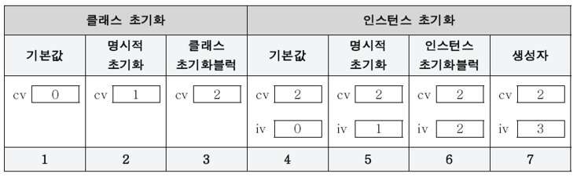

# 1. 객체지향언어

## 객체지향언어의 역사

요즘은 컴퓨터의 눈부신 발전으로 활용 폭이 넓고 다양해져서 컴퓨터가 사용되지 않는 분야가 없을 정도지만, 초창기에는 주로 과학실험이나 미사일 발사실험과 같은
모의실험(simulation)을 목적으로 사용되었다. 이 시절의 과학자들은 모의실험을 위해 실제 세계와 유사한 가상 세계를 컴퓨터 속에 구현하고자 노력하였으며
이러한 노력은 객체지향이론을 탄생시켰다.

객체지향이론의 기본 개념은 '실제 세계는 사물(객체)로 이루어져 있으며, 발생하는 모든 사건들은 사물간의 상호작용이다.'라는 것이다.   
실제 사물의 속성과 기능을 분석한 다음, 데이터(변수)와 함수로 정의함으로써 실제 세계를 컴퓨터 속에 옮겨 놓은 것과 같은 가상 세계를 구현하고 이 가상세계에서 모의실험을 함으로써 많은 시간과 비용을 절약할 수 있었다.

객체지향이론은 상속, 캡슐화, 추상화 개념을 중심으로 점차 구체적으로 발전되었으며 1960년대 중반에 객체지향이론을 프로그래밍언어에 적용한 시뮬라(Simula)라는 최초의
객체지향언어가 탄생하였다.

그 당시에는 FORTRAN이나 COBOL과 같은 절차적 언어들이 주류를 이루었으며, 객체지향언어는 널리 사용되지 못하고 있었다.
1980년대 중반에 C++을 비롯하여 여러 객체지향언어가 발표되면서 객체지향언어가 본격적으로 개발자들의 관심을 끌기 시작하였지만 여전히 사용자층이 넓지 못했다.

그러나 프로그램의 규모가 점점 커지고 사용자들의 요구가 빠르게 변화해가는 상황을 절차적 언어로는 극복하기 어렵다는 한계를 느끼고 객체지향언어를 이용한 개발방법론이
대안으로 떠오르게 되면서 조금씩 입지를 넓혀가고 있었다.

자바가 1995년에 발표되고 1990년대 말에 인터넷의 발전과 함께 크게 유행하면서 객체지향언어는 이제 프로그래밍언어의 주류로 자리 잡았다.


## 객체지향언어의 주요 특징
* 재사용성이 높다.
  * 새로운 코드를 작성할 때 기존의 코드를 이용하여 쉽게 작성할 수 있다.
* 유지보수가 용이하다.
  * 코드간의 관계를 이용해서 적은 노력으로 쉽게 코드를 변경할 수 있다.
* 신뢰성이 높다.
  * 제어자와 메서드를 이용해서 데이터를 보호하고 올바른 값을 유지하도록 하며,  
    코드의 중복을 제거하여 코드의 불일치로 인한 오동작을 방지할 수 있다.

객체지향언어의 가장 큰 장점은 '코드의 재사용성이 높고 유지보수가 용이하다.'는 것이다.  
이러한 객체지향언어의 장점은 프로그램의 개발과 유지보수에 드는 시간과 비용을 획기적으로 개선하였다.

앞으로 상속, 다형성과 같은 객체지향개념을 학습할 때 재사용성과 유지보수 그리고 중복된 코드의 제거,  
이 세 가지 관점에서 보면 보다 쉽게 이해할 수 있을 것이다.

# 2. 클래스와 객체

## 클래스와 객체의 정의와 용도

* **클래스의 정의** : 클래스란 객체를 정의해 놓은 것이다. (객체의 설계도 또는 틀)  
  **클래스의 용도** : 클래스는 객체를 생성하는데 사용된다.

  **객체의 정의** : 실제로 존재하는 것. 사물 또는 개념  
  **객체의 용도** : 객체가 가지고 있는 기능과 속성에 따라 다름

  **유형의 객체** : 책상, 의자, 자동차, TV와 같은 사물  
  **무형의 객체** : 수학공식, 프로그램 에러와 같은 논리나 개념

* 클래스를 정의하고 클래스를 통해 객체를 생성하는 이유
  * 클래스를 한번만 잘 만들어 놓기만 하면, 매번 객체를 생성할 때마다 어떻게 객체를 만들어야 할지 고민하지 않아도 된다.  
    만들어 놓은 클래스로부터 객체를 생성해서 사용하기만 하면 된다.

  * JDK(Java Development Kit)에서는 프로그래밍을 위해 많은 수의 유용한 클래스(Java API)를 기본적으로 제공하고 있으며,  
    이 클래스들을 이용해서 원하는 기능의 프로그램을 보다 쉽게 작성할 수 있다.

## 객체와 인스턴스

* 클래스로부터 객체를 만드는 과정을 클래스의 **인스턴스화(instantiate)** 라고 하며,  
  어떤 클래스로부터 만들어진 객체를 그 클래스의 **인스턴스(instance)** 라고 한다.

* 결국 인스턴스는 객체와 같은 의미이지만, 객체는 모든 인스턴스를 대표하는 포괄적인 의미를 갖고 있으며,  
  인스턴스는 어떤 클래스로부터 만들어진 것인지를 강조하는 보다 구체적인 의미를 갖고 있다.

* '책상은 인스턴스다.'라고 하기 보다는 '책상은 객체다.'라는 쪽이,  
  '책상은 책상 클래스의 객체이다.'라고 하기 보다는 '책상은 책상 클래스의 인스턴스다.'라고 하는 것이 더 자연스럽다.

* 인스턴스와 객체는 같은 의미이므로 두 용어의 사용을 엄격히 구분할 필요는 없지만, 문맥에 따라 구별하여 사용하는 것이 좋다.

## 객체의 구성요소

* 객체는 속성과 기능, 두 종류의 구성요소로 이루어져 있으며, 일반적으로 객체는 다수의 속성과 다수의 기능을 갖는다.  
  즉, 객체는 속성과 기능의 집합이라고 할 수 있으며 객체가 가지고 있는 속성과 기능을 그 객체의 멤버(구성원, member)라 한다.

* **속성(property)** : 멤버변수(member variable), 특성(attribute), 필드(field), 상태(state)  
  **기능(function)** : 메소드(method), 함수(function), 행위(behavior)

* 객체지향 프로그래밍에서는 속성과 기능을 각각 변수와 메소드로 표현한다.

## 클래스의 또 다른 정의

클래스는 '객체를 생성하기 위한 틀'이며 '클래스는 속성과 기능으로 정의되어있다.'고 했다.  
이것은 객체지향이론의 관점에서 내린 정의이고, 이번엔 프로그래밍적인 관점에서 클래스의 정의와 의미를 살펴보자.

* ### 클래스 - 데이터와 함수의 결합

  * 프로그래밍 언어에서 데이터 처리를 위한 데이터 저장형태의 발전과정은 다음과 같다.
  
    

  * **변수**   : 하나의 데이터를 저장할 수 있는 공간  
    **배열**   : 같은 종류의 여러 데이터를 하나의 집합으로 저장할 수 있는 공간  
    **구조체** : 서로 관련된 여러 데이터를 종류에 관계없이 하나의 집합으로 저장할 수 있는 공간  
    **클래스** : 데이터와 함수의 결합(구조체 + 함수)

  * 그동안 데이터와 함수가 서로 관계가 없는 것처럼 데이터는 데이터끼리, 함수는 함수끼리 따로 다루어져 왔지만,  
    사실 함수는 주로 데이터를 가지고 작업을 하기 때문에 많은 경우에 있어서 데이터와 함수는 관계가 깊다.

  * 그래서 객체지향언어에서는 변수와 함수를 하나의 클래스에 정의하여 서로 관계가 깊은 변수와 함수들을 함께 다룰 수 있게 했다.

  * 서로 관련된 변수들을 정의하고 이들에 대한 작업을 수행하는 함수들을 함께 정의한 것이 바로 클래스이다.

* ### 클래스 - 사용자정의 타입(user-defined type)

  * 프로그래밍언어에서 제공하는 자료형(primitive type)외에 프로그래머가 서로 관련된 변수들을 묶어서 하나의 타입으로  
    새로 추가하는 것을 사용자정의 타입(user-defined type)이라고 한다.

  * 자바와 같은 객체지향언어에서는 클래스가 곧 사용자 정의 타입이다.

  * 객체지향언어에서는 클래스에 제어자와 메서드를 이용해서 데이터 무결성을 유지할 수 있다.

# 3. 변수와 메소드

## 선언위치에 따른 변수의 종류

```java
class Variables {
    int iv;         // 인스턴스 변수
    static int cv;  // 클래스 변수(static 변수, 공유 변수)
    
    void method() {
        int lv = 0; // 지역 변수
    }
}
```
|변수의 종류|선언위치|생성시기|
|:---:|:---:|:---:|
|클래스변수<br>(class variable)|클래스 영역|클래스가 메모리에 올라갈 때|
|인스턴스변수<br>(instance variable)|클래스 영역|인스턴스가 생성되었을 때|
|지역변수<br>(local variable)|클래스 영역 이외의 영역<br>(메소드, 생성자, 초기화 블럭 내부)|변수 선언문이 수행되었을 때|

* ### 인스턴스 변수(instance variable)
  * 클래스 영역에 선언되며, 클래스의 인스턴스를 생성할 때 만들어진다.  
    그렇기 때문에 인스턴스 변수의 값을 읽어 오거나 저장하기 위해서는 먼저 인스턴스를 생성해야한다.

  * 인스턴스는 독립적인 저장공간을 가지므로 서로 다른 값을 가질 수 있다.  
    인스턴스마다 고유한 상태를 유지해야하는 속성의 경우, 인스턴스 변수로 선언한다.

* ### 클래스 변수(class variable)
  * 클래스 변수를 선언하는 방법은 인스턴스 변수 앞에 static을 붙이기만 하면 된다.
  
  * 클래스 변수는 모든 인스턴스가 공통된 저장공간(변수)을 공유하기 때문에  
    한 클래스의 모든 인스턴스들이 공통적인 값을 유지해야하는 속성의 경우 클래스 변수로 선언해야 한다.
  
  * 클래스 변수는 인스턴스 변수와 달리 인스턴스를 생성하지 않고도 언제라도 바로 사용할 수 있다는 특징이 있으며,  
    '클래스이름.클래스변수'와 같은 형식으로 사용한다.
  
  * 클래스가 메모리에 로딩(loading)될 때 생성되어 프로그램이 종료될 때 까지 유지되며,  
    public을 앞에 붙이면 같은 프로그램 내에서 어디서나 접근할 수 있는 전역변수(global variable)의 성격을 갖는다.

* ### 지역변수(local variable)
  * 메소드 내에 선언되어 메소드 내에서만 사용 가능하며, 메소드가 종료되면 소멸되어 사용할 수 없게 된다.
  
  * for문 또는 while문의 블럭 내에 선언된 지역변수는 지역변수가 선언된 블럭{} 내에서만 사용 가능하며,  
    블럭{}을 벗어나면 소멸되어 사용할 수 없게 된다.

## 메소드

'메소드(method)'는 특정 작업을 수행하는 일련의 문장들을 하나로 묶은 것이다.

### 메소드를 사용하는 이유

* #### 높은 재사용성(reusability)
  * 이미 Java API에서 제공하는 메서드들을 사용하면서 경험한 것처럼 한번 만들어 놓은 메소드는 몇 번이고 호출할 수 있으며,  
    다른 프로그램에서도 사용이 가능하다.

* #### 중복된 코드의 제거
  * 반복되는 문장들을 묶어서 하나의 메소드로 작성해 놓으면, 반복되는 문장들 대신 메소드를 호출하는 한 문장으로 대체할 수 있다.  
    그러면 소스 코드의 길이도 짧아지고, 변경사항이 발생했을 때 수정해야할 코드의 양이 줄어들어 오류가 발생할 가능성도 함께 줄어든다.

* #### 프로그램의 구조화
  * 작은 프로그램을 작성할 때는 main 메서드 안에 모든 문장을 넣는 식으로 해도 별 문제가 없지만,  
    큰 규모의 프로그램에서는 문장들을 작업단위로 나눠서 여러 개의 메서드에 담아 프로그램의 구조를 단순화시키는 것이 필수적이다.

    ```java
    public static void main(String[] args) {
        int[] arr = new int[10];

        initArr(arr);
        printArr(arr);
        sortArr(arr);
        printArr(arr);
    }
    ```

  * 이처럼 main메서드는 프로그램의 전체 흐름이 한눈에 들어올 정도로 단순하게 구조화하는 것이 좋다.  
    그래야 나중에 프로그램에 문제가 발생해도 해당 부분을 쉽게 찾아서 해결할 수 있다.

  * 처음에 프로그램을 설계할 때 내용이 없는 메서드를 작업단위로 만들어 놓고,  
    하나씩 완성해가는 것도 프로그램을 구조화하는 좋은 방법이다.

## JVM의 메모리 구조

응용프로그램이 실행되면, JVM은 시스템으로부터 프로그램을 수행하는데 필요한 메모리를 할당받고  
JVM은 이 메모리를 용도에 따라 여러 영역으로 나누어 관리한다.


* #### 메소드 영역(method area)
  * 프로그램 실행 중 어떤 클래스가 사용되면, JVM은 해당 클래스의 클래스파일(\*.class)을 읽어서 분석하여  
    클래스에 대한 정보(클래스 데이터)를 이곳에 저장한다. 이 때, 그 클래스의 클래스 변수(class variable)도 이 영역에 함께 생성된다.

* #### 힙(heap)
  * 인스턴스가 생성되는 공간. 프로그램 실행 중 생성되는 인스턴스는 모두 이곳에 생성된다.  
    즉, 인스턴스 변수(instance variable)들이 생성되는 공간이다.

* #### 호출 스택(call stack 또는 execution stack)
  * 호출 스택은 메서드의 작업에 필요한 메모리 공간을 제공한다.
  
  * 메소드가 호출되면, 호출스택에 호출된 메소드를 위한 메모리가 할당되며,  
    이 메모리는 메소드가 작업을 수행하는 동안 지역변수(매개변수 포함)들과 연산의 중간결과 등을 저장하는데 사용된다.
    
  * 메소드가 작업을 마치면 할당되었던 메모리 공간은 반환되어 비워진다.
    
  * 반환타입(return type)이 있는 메소드는 종료되면서 결과값을 자신을 호출한 메소드(caller)에게 반환한다.  
    대기상태에 있던 호출한 메소드(caller)는 넘겨받은 반환값으로 수행을 계속 진행하게 된다.

## 클래스 메소드(static 메소드)와 인스턴스 메소드

인스턴스 메소드는 인스턴스 변수와 관련된 작업을 하는, 즉 메소드의 작업을 수행하는 데 인스턴스 변수를 필요로 하는 메소드이다.  
그런데 인스턴스 변수는 인스턴스를 생성해야만 만들어지므로 인스턴스 메소드 역시 인스턴스를 생성해야만 호출할 수 있다.

반면에 메소드 중에서 인스턴스와 관계없는(인스턴스 변수나 인스턴스 메소드를 사용하지 않는) 메소드를 클래스 메소드로 정의한다.  
물론 인스턴스 변수를 사용하지 않는다고 해서 반드시 클래스 메소드로 정의해야하는 것은 아니지만 특별한 이유가 없는 한 그렇게 하는 것이 일반적이다.

* #### 클래스를 설계할 때, 멤버 변수 중 모든 인스턴스에 공통된 값을 유지해야하는 것에 static을 붙인다.

* #### 클래스 변수는 인스턴스를 생성하지 않아도 사용할 수 있다.

* #### 클래스 메소드는 인스턴스 변수를 사용할 수 없다.
  * 인스턴스 변수는 인스턴스가 반드시 존재해야만 사용할 수 있는데, 클래스 메소드는 인스턴스 생성 없이 호출가능하므로  
    클래스 메소드가 호출되었을 때 인스턴스가 존재하지 않을 수도 있다. 그래서 클래스 메소드에서 인스턴스 변수의 사용을 금지한다.

  * 반면에 인스턴스 변수나 인스턴스 메소드에서는 클래스 멤버들을 사용하는 것이 언제나 가능하다.  
    인스턴스 변수가 존재한다는 것은 클래스 변수가 이미 메모리에 존재한다는 것을 의미하기 때문이다.

* #### 메소드 내에서 인스턴스 변수를 사용하지 않는다면, static을 붙이는 것을 고려한다.
  * 메소드의 작업내용 중에서 인스턴스 변수를 필요로 한다면 static을 붙일 수 없다.  
    반대로 인스턴스 변수를 필요로 하지 않는다면 static을 붙이자.
    
  * static을 붙이면 메소드 호출시간이 짧아지므로 성능이 향상된다.  
    인스턴스 메소드는 실행 시 호출되어야할 메소드를 찾는 과정이 추가적으로 필요하기 때문에 시간이 더 걸린다.

## 클래스 멤버와 인스턴스 멤버간의 참조와 호출

같은 클래스에 속한 멤버들 간에는 별도의 인스턴스를 생성하지 않고도 서로 참조 또는 호출이 가능하다.  
단, 클래스 멤버가 인스턴스 멤버를 참조 또는 호출하고자 하는 경우에는 인스턴스를 생성해야 한다.

그 이유는 인스턴스 멤버가 존재하는 시점에 클래스 멤버는 항상 존재하지만,  
클래스 멤버가 존재하는 시점에 인스턴스 멤버가 존재하지 않을 수도 있기 때문이다.

```java
class MemberCall {
    int iv = 10;
    static int cv = 20;

    int iv2 = cv;
//  static int cv2 = iv;                    // 클래스 변수는 인스턴스 변수를 사용할 수 없음.
    static int cv2 = new MemberCall().iv;   // 인스턴스를 생성해야 사용 가능.

    void instanceMethod1() {
        System.out.println(iv);
        System.out.println(cv);		
    }

    static void staticMethod1() {
//      System.out.println(iv);                     // 클래스 메소드에서 인스턴스 변수 사용 불가.
        System.out.println(new MemberCall().iv);    // 인스턴스를 생성해야 사용 가능.
        System.out.println(cv);
    }

    void instanceMethod2() {
        instanceMethod1();
        staticMethod1();
    }

    static void staticMethod2() {
//      instanceMethod1();                  // 클래스 메소드에서 인스턴스 메소드를 호출할 수 없음.
        new MemberCall().instanceMethod1(); // 인스턴스를 생성해야 호출 가능.
        staticMethod1();
    }
}
```

실제로는 같은 클래스 내에서 클래스 멤버가 인스턴스 멤버를 참조 또는 호출해야하는 경우는 드물다.  
만일 그런 경우가 발생한다면, 인스턴스 메소드로 작성해야할 것을 클래스 메소드로 한 것은 아닌지 한 번 더 생각해봐야 한다.

# 4. 오버로딩(overloading)

## 오버로딩이란?

한 클래스 내에 같은 이름의 메소드를 여러 개 정의하는 것을 '메소드 오버로딩(method overloading)'  
또는 간단히 '오버로딩(overloading)'이라 한다.

## 오버로딩의 조건

* #### 메소드 이름이 같아야 한다.
* #### 매개변수의 개수 또는 타입이 달라야 한다.
  * 메소드의 이름이 같다 하더라도 매개변수가 다르면 서로 구별될 수 있기 때문에 오버로딩이 가능한 것이다.
  * 위의 조건을 만족시키지 못하는 메소드는 중복 정의로 간주되어 컴파일 시에 에러가 발생한다.
  * 오버로딩된 메소드들은 매개변수에 의해서만 구별될 수 있으므로 **반환 타입은 오버로딩을 구현하는데 영향을 주지 못한다.**

## 오버로딩의 예

오버로딩의 예로 가장 대표적인 것은 println 메소드이다.  
지금까지 println 메소드 괄호 안에 값만 지정해주면 화면에 출력하는데 아무런 어려움이 없었지만,  
실제로는 매개변수로 지정하는 값의 타입에 따라서 호출되는 println 메소드가 달라진다.

```java
public class PrintStream extends FilterOutputStream implements Appendable, Closeable {
    ...
    public void println() {...}
    public void println(boolean x) {...}
    public void println(char x) {...}
    public void println(char[] x) {...}
    public void println(double x) {...}
    public void println(float x) {...}
    public void println(int x) {...}
    public void println(long x) {...}
    public void println(Object x) {...}
    public void println(String x) {...}
    ...
}
```

## 오버로딩의 장점

* #### 메소드 이름을 짓기도 쉽고, 기억하기도 쉽다.
  * 메소드도 변수처럼 단지 이름만으로 구별된다면, 한 클래스내의 모든 메소드들은 이름이 달라야한다.  
    그렇다면, 이전에 예로 들었던 10가지의 println 메소드들은 각기 다른 이름을 가져야 한다.

  * 모두 근본적으로는 같은 기능을 하는 메소드들이지만, 서로 다른 이름을 가져야 하기 때문에  
    메소드를 작성하는 쪽에서는 이름을 짓기도 어렵고, 사용하는 쪽에서는 이름을 일일이 구분해서 기억해야만 한다.

  * 그러나 오버로딩을 통해 여러 메소드들이 하나의 이름으로 정의될 수 있다면,  
    메소드의 이름을 짓는데 고민을 덜 수 있는 동시에 기억하기도 쉬워진다.

* #### '메소드의 이름이 같으므로 같은 기능을 하겠구나'라고 쉽게 예측할 수 있다.

* #### 메소드의 이름을 절약할 수 있다.
  * 사용되었어야 할 메소드 이름을 다른 메소드의 이름으로 사용할 수 있다.

## 가변인자(varargs)와 오버로딩

기존에는 메소드의 매개변수 개수가 고정적이었으나 JDK 1.5부터 동적으로 지정해 줄 수 있게 되었으며,  
이 기능을 '가변인자(variable arguments)'라고 한다.

가변인자는 **'타입... 변수명'** 과 같은 형식으로 선언하며, PrintStream 클래스의 printf() 메소드가 대표적인 예이다.

```java
public PrintStream printf(String format, Object... args) {...}
```

위와 같이 가변인자 외에도 매개변수가 더 있다면, 가변인자를 매개변수 중에서 제일 마지막에 선언해야 한다.  
그렇지 않으면, 컴파일 에러가 발생한다. 가변인자인지 아닌지를 구별할 방법이 없기 때문에 허용하지 않는 것이다.

```java
// 컴파일 에러 발생 - 가변인자는 항상 마지막 매개변수이어야 한다.
public PrintStream printf(Object... args, String format) { ... }
```

만약 여러 문자열을 하나로 결합하여 반환하는 concatenate 메소드를 작성한다면,  
가변인자를 사용해 메소드 하나로 간단히 대체할 수 있다.

```java
String concatenate(String... str) {...}
```

이 메소드를 호출할 때는 아래와 같이 인자의 개수를 가변적으로 할 수 있다.  
심지어는 **인자가 아예 없어도 되고 배열도 인자가 될 수 있다.**

```java
concatenate();                          // 인자가 없음
concatenate("a");
concatenate("a", "b");
concatenate(new String[]{"a", "b"});    // 배열도 가능
```

가변인자는 내부적으로 배열을 이용하기 때문에, 가변인자가 선언된 메소드를 호출할 때마다 배열이 새로 생성된다.  
가변인자가 편리하지만, 이런 비효율이 숨어있으므로 꼭 필요한 경우에만 가변인자를 사용하는 것이 좋다.

그러면 가변인자는 아래와 같이 매개변수의 타입을 배열로 하는 것과 어떤 차이가 있는가?

```java
String concatenate(String[] str) {...}

concatenate(new String[0]); // 인자로 길이가 0인 배열을 지정
concatenate(null);          // 인자로 null을 지정
concatenate();              // 에러. 인자가 필요함.
```

매개변수의 타입을 배열로 하면, 반드시 인자를 지정해 줘야하기 때문에, 위에 코드에서처럼 인자를 생략할 수 없다.  
그래서 길이가 0인 배열이나 null을 인자로 지정해줘야 하는 불편함이 있다.

가변인자를 오버로딩할 때 한 가지 주의해야할 점이 있다.

```java
class Example {
    public static void main(String[] args) {
        concatenate("-", new String[] {"100", "200", "300"});
//      concatenate("-", "100", "200", "300");  // 에러.
//      concatenate("a");                       // 에러.
    }

    static String concatenate(String delim, String... args) {
        String result = "";

        for(String str : args)
        result += str + delim;

        return result;
    }

    static String concatenate(String... args) {
        return concatenate("", args);
    }
}
```

에러의 내용을 살펴보면 오버로딩된 메소드가 구분되지 않아서 발생하는 것임을 알 수 있다.  
가변인자를 선언한 메소드를 오버로딩하면, 메소드를 호출했을 때 이와 같이 구별되지 않는 경우가 발생하기 쉽기 때문에  
주의해야 한다. 가능하면 가변인자를 사용한 메소드는 오버로딩하지 않는 것이 좋다.

# 5. 생성자(Constructor)

## 생성자란?

생성자는 인스턴스가 생성될 때 호출되는 '인스턴스 초기화 메소드'이다.  
따라서 인스턴스 변수의 초기화 작업에 주로 사용되며, 인스턴스 생성 시에 실행되어야 할 작업을 위해서도 사용된다.

### 생성자의 조건
```
1. 생성자의 이름은 클래스의 이름과 같아야 한다.
2. 생성자는 리턴 값이 없다.
```

**연산자 new가 인스턴스를 생성하는 것이지 생성자가 인스턴스를 생성하는 것이 아니다.**  
생성자는 단순히 인스턴스 변수들의 초기화에 사용되는 조금 특별한 메소드일 뿐이다.  
생성자가 갖는 몇 가지 특징만 제외하면 메소드와 다르지 않다.

```
Card c = new Card();

1. 연산자 new에 의해서 메모리(heap)에 Card 클래스의 인스턴스가 생성된다.
2. 생성자 Card()가 호출되어 수행된다.
3. 연산자 new의 결과로 생성된 Card 인스턴스의 주소가 반환되어 참조변수 c에 저장된다.
```

## 기본 생성자(default constructor)

모든 클래스에는 반드시 하나 이상의 생성자가 정의되어 있어야 한다.

컴파일 할 때, 소스파일(\*.java)의 클래스에 생성자가 하나도 정의되지 않은 경우  
컴파일러는 자동적으로 아래와 같은 내용의 기본 생성자를 추가하여 컴파일 한다.

`클래스 이름() {}`

```java
class Data1 {
    int value;
}

class Data2 {
    int value;
    
    Data2(int x) {
        value = x;
    }
}

class Example {
    public static void main(String[] args) {
        Data1 d1 = new Data1();
        Data2 d2 = new Data2(); // compile error 발생
    }
}
```

Data1 클래스에는 정의되어 있는 생성자가 하나도 없으므로 컴파일러가 기본 생성자를 추가해주었지만,  
Data2 클래스에는 이미 생성자 Data2(int x)가 정의되어 있으므로 기본 생성자가 추가되지 않는다.

컴파일러가 자동적으로 기본 생성자를 추가해주는 경우는 클래스 내에 생성자가 하나도 없을 때 뿐이다.

## 생성자에서 다른 생성자 호출하기 - this(), this

같은 클래스의 멤버들 간에 서로 호출할 수 있는 것처럼 생성자 간에도 서로 호출이 가능하다.  
단, 다음의 두 조건을 만족시켜야 한다.

```
1. 생성자의 이름으로 클래스 이름 대신 this를 사용한다.
2. 한 생성자에서 다른 생성자를 호출할 때는 반드시 첫 줄에서만 호출이 가능하다.
```

생성자에서 다른 생성자를 첫 줄에서만 호출이 가능하도록 한 이유는 생성자 내에서 초기화 작업도중에 다른 생성자를 호출하게 되면,
호출된 다른 생성자 내에서도 멤버변수들의 값을 초기화 할 것이므로 다른 생성자를 호출하기 이전의 초기화 작업이 무의미해질 수 있기 때문이다.

```java
class Car {
    String color;
    String gearType;
    int door;
    
    Car() {
        color = "white";
        gearType = "auto";
        door = 4;
    }
    
    Car(String c, String g, int d) {
        color = c;
        gearType = g;
        door = d;
    }
}
```

```java
class Car {
    String color;
    String gearType;
    int door;
    
    Car() {
        this("white", "auto", 4);
    }
    
    Car(String color, String gearType, int door) {
        this.color = color;
        this.gearType = gearType;
        this.door = door;
    }
}
```

아래쪽 코드의 생성자 Car()에서 또 다른 생성자 Car(String color, String gearType, int door)를 활용하여 더 간략히 하였다.

같은 클래스 내의 생성자들은 일반적으로 서로 관계가 깊은 경우가 많아서 이처럼 서로 호출하도록 하여 유기적으로 연결해주면
더 좋은 코드를 얻을 수 있다. 그리고 수정이 필요한 경우에도 보다 적은 코드만을 변경하면 되므로 유지보수가 쉬워진다.


생성자의 매개변수로 선언된 변수의 이름이 인스턴스 변수와 같은 경우에는 이름만으로는 두 변수가 구별이 안 된다.
이런 경우에는 인스턴스 변수 앞에 'this'를 사용하면 된다.

'this'는 참조변수로 인스턴스 자신을 가리킨다.
참조변수를 통해 인스턴스의 멤버에 접근할 수 있는 것처럼, 'this'로 인스턴스 변수에 접근할 수 있는 것이다.

하지만 'this'를 사용할 수 있는 것은 인스턴스 멤버뿐이다.
클래스 메소드에서는 인스턴스 멤버를 사용할 수 없는 것처럼, 'this' 역시 사용할 수 없다.
왜냐하면 클래스 메소드는 인스턴스를 생성하지 않고도 호출될 수 있으므로 클래스 메소드가 호출된 시점에 인스턴스가 존재하지 않을 수도 있기 때문이다.

사실 생성자를 포함한 모든 인스턴스 메소드에는 자신이 관련된 인스턴스를 가리키는 참조변수 'this'가 지역변수로 숨겨진 채로 존재한다.
일반적으로 인스턴스 메소드는 특정 인스턴스와 관련된 작업을 하기 때문에 자신과 관련된 인스턴스의 정보가 필요하지만,
클래스 메소드는 인스턴스와 관련 없는 작업을 하기 때문에 인스턴스에 대한 정보가 필요 없기 때문이다.

this : 인스턴스 자신을 가리키는 참조변수, 인스턴스의 주소가 저장되어 있다. 모든 인스턴스 메소드에 지역변수로 숨겨진 채로 존재한다.
this(), this(매개변수) : 생성자, 같은 클래스의 다른 생성자를 호출할 때 사용한다.

# 6. 변수의 초기화

## 변수의 초기화

변수를 선언하고 처음으로 값을 저장하는 것을 '변수의 초기화'라고 한다.

멤버 변수는 초기화를 하지 않아도 자동적으로 변수의 자료형에 맞는 기본값으로 초기화가 이루어지므로  
초기화하지 않고 사용해도 되지만, 지역변수는 사용하기 전에 반드시 초기화해야 한다.

### 멤버변수의 초기화 방법

* 명시적 초기화(explicit initialization)
* 생성자(constructor)
* 초기화 블럭(initialization block)
  * 인스턴스 초기화 블럭 : 인스턴스 변수를 초기화 하는데 사용.
  * 클래스 초기화 블럭 : 클래스 변수를 초기화 하는데 사용.

## 명시적 초기화(explicit initialization)

변수를 선언과 동시에 초기화하는 것을 명시적 초기화라고 한다.  
가장 기본적이면서도 간단한 초기화 방법이므로 여러 초기화 방법 중에서 가장 우선적으로 고려되어야 한다.

## 초기화 블럭(initialization block)

```
클래스 초기화 블럭  : 클래스 변수의 복잡한 초기화에 사용된다.  
인스턴스 초기화 블럭 : 인스턴스 변수의 복잡한 초기화에 사용된다.
```

초기화 블럭 내에는 메소드 내에서와 같이 조건문, 반복문, 예외처리구문 등을 자유롭게 사용할 수 있으므로,  
초기화 작업이 복잡하여 명시적 초기화만으로는 부족한 경우 초기화 블럭을 사용한다.

```java
class InitBlock {
    static { /* 클래스 초기화 블럭 */ }
    
    { /* 인스턴스 초기화 블럭 */ }
}
```

클래스 초기화 블럭은 클래스가 메모리에 처음 로딩될 때 한번만 수행되며,  
인스턴스 초기화 블럭은 생성자와 같이 인스턴스를 생성할 때 마다 수행된다.  
그리고 생성자 보다 인스턴스 초기화 블럭이 먼저 수행된다.

참고
클래스가 처음 로딩될 때 클래스 변수들이 자동적으로 메모리에 만들어지고,
곧바로 클래스 초기화 블럭이 클래스 변수들을 초기화하게 되는 것이다.

인스턴스 변수의 초기화는 주로 생성자를 사용하고,  
인스턴스 초기화 블럭은 모든 생성자에서 공통으로 수행돼야 하는 코드를 넣는데 사용한다.

```java
class Car {
    static int count = 0;
    int serialNo;
    
    {
        count++;
        serialNo = count;
    }
    
    Car(...) {...}
    Car(...) {...}
    Car(...) {...}
}
```

클래스의 모든 생성자에 공통으로 수행되어야 하는 문장들이 있을 때,
이 문장들을 각 생성자마다 써주기 보다는 위와 같이 인스턴스 블럭에 넣어주면 코드가 보다 간결해진다.
이처럼 코드의 중복을 제거하는 것은 코드의 신뢰성을 높여 주고, 오류의 발생가능성을 줄여 준다는 장점이 있다.

```java
class StaticBlockExample {
    static int[] arr = new int[10];
    
    static {
        for(int i = 0; i < arr.length; i++)
            arr[i] = (int)(Math.random() * 10) + 1;
    }
    
    ...
}
```

## 멤버변수의 초기화 시기와 순서

```
클래스 변수의 초기화 시점      클래스가 처음 로딩될 때 단 한번 초기화 된다.  
인스턴스 변수의 초기화 시점    인스턴스가 생성될 때마다 각 인스턴스 별로 초기화가 이루어진다.

클래스 변수의 초기화 순서      기본값 -> 명시적 초기화 -> 클래스 초기화 블럭  
인스턴스 변수의 초기화 순서    기본값 -> 명시적 초기화 -> 인스턴스 초기화 블럭 -> 생성자
```

프로그램 실행도중 클래스에 대한 정보가 요구될 때 클래스는 메모리에 로딩된다.  
예를 들면, 클래스 멤버를 사용했을 때, 인스턴스를 생성할 때 등이 이에 해당한다.  
하지만, 해당 클래스가 이미 메모리에 로딩되어 있다면, 또다시 로딩하지 않는다. 물론 초기화도 다시 수행되지 않는다.

참고
클래스의 로딩 시기는 JVM의 종류에 따라 좀 다를 수 있는데, 클래스가 필요할 때 바로 메모리에 로딩하도록 설계가 되어있는 것도 있고,
실행효율을 높이기 위해서 사용될 클래스들을 프로그램이 시작될 때 미리 로딩하도록 되어있는 것도 있다.

```java
class InitTest {
    static int cv = 1;      // 명시적 초기화
    int iv = 1;             // 명시적 초기화
    
    static { cv = 2; }      // 클래스 초기화 블럭
    
    { iv = 2; }             // 인스턴스 초기화 블럭
    
    InitTest() { iv = 3; }  // 생성자
}
```

`new InitTest();`와 같이 하여 인스턴스를 생성했을 때, cv와 iv가 초기화되어가는 과정을 살펴보자.



**클래스 변수 초기화 (1~3)** : 클래스가 처음 메모리에 로딩될 때 차례대로 수행됨.  
**인스턴스 변수 초기화 (4~7)** : 인스턴스를 생성할 때 차례대로 수행됨.

```
1. cv가 메모리(method area)에 생성되고, cv에는 int형의 기본값인 0이 cv에 저장된다.
2. 명시적 초기화(static int cv = 1;)에 의해서 cv에 1이 저장된다.
3. 클래스 초기화 블럭(cv = 2;)이 수행되어 cv에는 2가 저장된다.
4. InitTest 클래스의 인스턴스가 생성되면서 iv가 메모리(heap)에 존재하게 된다. int형의 기본값인 0이 iv에 저장된다.
5. 명시적 초기화(int iv = 1;)에 의해서 iv에 1이 저장된다.
6. 인스턴스 초기화 블럭(iv = 2;)이 수행되어 iv에 2가 저장된다.
7. 생성자(iv = 3;)가 수행되어 iv에는 3이 저장된다.
```
