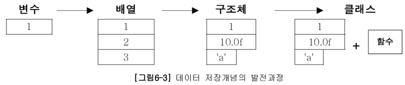
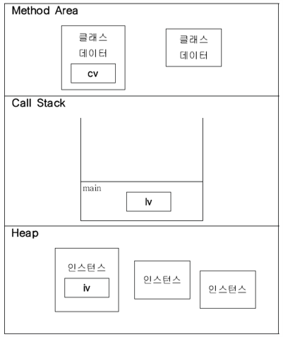

# 1. 객체지향언어

## 1.1 객체지향언어의 역사

요즘은 컴퓨터의 눈부신 발전으로 활용 폭이 넓고 다양해져서 컴퓨터가 사용되지 않는 분야가 없을 정도지만, 초창기에는 주로 과학실험이나 미사일 발사실험과 같은
모의실험(simulation)을 목적으로 사용되었다. 이 시절의 과학자들은 모의실험을 위해 실제 세계와 유사한 가상 세계를 컴퓨터 속에 구현하고자 노력하였으며
이러한 노력은 객체지향이론을 탄생시켰다.

객체지향이론의 기본 개념은 '실제 세계는 사물(객체)로 이루어져 있으며, 발생하는 모든 사건들은 사물간의 상호작용이다.'라는 것이다. 실제 사물의 속성과 기능을
분석한 다음, 데이터(변수)와 함수로 정의함으로써 실제 세계를 컴퓨터 속에 옮겨 놓은 것과 같은 가상 세계를 구현하고 이 가상세계에서 모의실험을 함으로써 많은 시간과
비용을 절약할 수 있었다.

객체지향이론은 상속, 캡슐화, 추상화 개념을 중심으로 점차 구체적으로 발전되었으며 1960년대 중반에 객체지향이론을 프로그래밍언어에 적용한 시뮬라(Simula)라는 최초의
객체지향언어가 탄생하였다.

그 당시에는 FORTRAN이나 COBOL과 같은 절차적 언어들이 주류를 이루었으며, 객체지향언어는 널리 사용되지 못하고 있었다.
1980년대 중반에 C++을 비롯하여 여러 객체지향언어가 발표되면서 객체지향언어가 본격적으로 개발자들의 관심을 끌기 시작하였지만 여전히 사용자층이 넓지 못했다.

그러나 프로그램의 규모가 점점 커지고 사용자들의 요구가 빠르게 변화해가는 상황을 절차적 언어로는 극복하기 어렵다는 한계를 느끼고 객체지향언어를 이용한 개발방법론이
대안으로 떠오르게 되면서 조금씩 입지를 넓혀가고 있었다.

자바가 1995년에 발표되고 1990년대 말에 인터넷의 발전과 함께 크게 유행하면서 객체지향언어는 이제 프로그래밍언어의 주류로 자리 잡았다.


## 1.2 객체지향언어의 주요 특징

- 재사용성이 높다.
  - 새로운 코드를 작성할 때 기존의 코드를 이용하여 쉽게 작성할 수 있다.
- 유지보수가 용이하다.
  - 코드간의 관계를 이용해서 적은 노력으로 쉽게 코드를 변경할 수 있다.
- 신뢰성이 높다.
  - 제어자와 메서드를 이용해서 데이터를 보호하고 올바른 값을 유지하도록 하며,<br> 코드의 중복을 제거하여 코드의 불일치로 인한 오동작을 방지할 수 있다.

객체지향언어의 가장 큰 장점은 '코드의 재사용성이 높고 유지보수가 용이하다.'는 것이다.
이러한 객체지향언어의 장점은 프로그램의 개발과 유지보수에 드는 시간과 비용을 획기적으로 개선하였다.

앞으로 상속, 다형성과 같은 객체지향개념을 학습할 때 재사용성과 유지보수 그리고 중복된 코드의 제거, 이 세 가지 관점에서 보면 보다 쉽게 이해할 수 있을 것이다.

# 2. 클래스와 객체

## 2.1 클래스와 객체의 정의와 용도

클래스의 정의 : 클래스란 객체를 정의해 놓은 것이다. (객체의 설계도 또는 틀)
클래스의 용도 : 클래스는 객체를 생성하는데 사용된다.

객체의 정의 : 실제로 존재하는 것. 사물 또는 개념
객체의 용도 : 객체가 가지고 있는 기능과 속성에 따라 다름

유형의 객체 : 책상, 의자, 자동차, TV와 같은 사물
무형의 객체 : 수학공식, 프로그램 에러와 같은 논리나 개념

클래스를 정의하고 클래스를 통해 객체를 생성하는 이유

클래스를 한번만 잘 만들어 놓기만 하면, 매번 객체를 생성할 때마다 어떻게 객체를 만들어야 할지 고민하지 않아도 된다.
만들어 놓은 클래스로부터 객체를 생성해서 사용하기만 하면 된다.

JDK(Java Development Kit)에서는 프로그래밍을 위해 많은 수의 유용한 클래스(Java API)를 기본적으로 제공하고 있으며,
이 클래스들을 이용해서 원하는 기능의 프로그램을 보다 쉽게 작성할 수 있다.

## 2.2 객체와 인스턴스

클래스로부터 객체를 만드는 과정을 클래스의 인스턴스화(instantiate)라고 하며,
어떤 클래스로부터 만들어진 객체를 그 클래스의 인스턴스(instance)라고 한다.

결국 인스턴스는 객체와 같은 의미이지만,
객체는 모든 인스턴스를 대표하는 포괄적인 의미를 갖고 있으며,
인스턴스는 어떤 클래스로부터 만들어진 것인지를 강조하는 보다 구체적인 의미를 갖고 있다.

'책상은 인스턴스다.'라고 하기 보다는 '책상은 객체다.'라는 쪽이,
'책상은 책상 클래스의 객체이다.'라고 하기 보다는 '책상은 책상 클래스의 인스턴스다.'라고 하는 것이 더 자연스럽다.

인스턴스와 객체는 같은 의미이므로 두 용어의 사용을 엄격히 구분할 필요는 없지만,
문맥에 따라 구별하여 사용하는 것이 좋다.

## 2.3 객체의 구성요소

객체는 속성과 기능, 두 종류의 구성요소로 이루어져 있으며, 일반적으로 객체는 다수의 속성과 다수의 기능을 갖는다.
즉, 객체는 속성과 기능의 집합이라고 할 수 있다. 그리고 객체가 가지고 있는 속성과 기능을 그 객체의 멤버(구성원, member)라 한다.

속성(property) : 멤버변수(member variable), 특성(attribute), 필드(field), 상태(state)<br>
기능(function) : 메서드(method), 함수(function), 행위(behavior)

객체지향 프로그래밍에서는 속성과 기능을 각각 변수와 메서드로 표현한다.

## 2.6 클래스의 또 다른 정의

클래스는 '객체를 생성하기 위한 틀'이며 '클래스는 속성과 기능으로 정의되어있다.'고 했다.
이것은 객체지향이론의 관점에서 내린 정의이고, 이번엔 프로그래밍적인 관점에서 클래스의 정의와 의미를 살펴보자.

### 1. 클래스 - 데이터와 함수의 결합

프로그래밍언어에서 데이터 처리를 위한 데이터 저장형태의 발전과정은 다음과 같다.



1.변수   : 하나의 데이터를 저장할 수 있는 공간<br>
2.배열   : 같은 종류의 여러 데이터를 하나의 집합으로 저장할 수 있는 공간<br>
3.구조체 : 서로 관련된 여러 데이터를 종류에 관계없이 하나의 집합으로 저장할 수 있는 공간<br>
4.클래스 : 데이터와 함수의 결합(구조체 + 함수)<br>

그동안 데이터와 함수가 서로 관계가 없는 것처럼 데이터는 데이터끼리, 함수는 함수끼리 따로 다루어져 왔지만,
사실 함수는 주로 데이터를 가지고 작업을 하기 때문에 많은 경우에 있어서 데이터와 함수는 관계가 깊다.

그래서 자바와 같은 객체지향언어에서는 변수(데이터)와 함수를 하나의 클래스에 정의하여 서로 관계가 깊은 변수와 함수들을 함께 다룰 수 있게 했다.

서로 관련된 변수들을 정의하고 이들에 대한 작업을 수행하는 함수들을 함께 정의한 것이 바로 클래스이다.

### 2. 클래스 - 사용자정의 타입(user-defined type)

프로그래밍언어에서 제공하는 자료형(primitive type)외에 프로그래머가 서로 관련된 변수들을 묶어서 하나의 타입으로 새로 추가하는 것을
사용자정의 타입(user-defined type)이라고 한다.

다른 프로그래밍언어에서도 사용자정의 타입을 정의할 수 있는 방법을 제공하고 있으며 자바와 같은 객체지향언어에서는 클래스가 곧 사용자 정의 타입이다.

객체지향언어에서는 클래스에 제어자와 메서드를 이용해서 데이터 무결성을 유지할 수 있다.

# 3. 변수와 메서드

## 3.1 선언위치에 따른 변수의 종류

```java
class Variables {
    int iv;         // 인스턴스 변수
    static int cv;  // 클래스 변수(static 변수, 공유 변수)
    
    void method() {
        int lv = 0; // 지역 변수
    }
}
```
|변수의 종류|선언위치|생성시기|
|:---:|:---:|:---:|
|클래스변수<br>(class variable)|클래스 영역|클래스가 메모리에 올라갈 때|
|인스턴스변수<br>(instance variable)|클래스 영역|인스턴스가 생성되었을 때|
|지역변수<br>(local variable)|클래스 영역 이외의 영역<br>(메서드, 생성자, 초기화 블럭 내부)|변수 선언문이 수행되었을 때|

### 1. 인스턴스 변수(instance variable)
클래스 영역에 선언되며, 클래스의 인스턴스를 생성할 때 만들어진다.
그렇기 때문에 인스턴스 변수의 값을 읽어 오거나 저장하기 위해서는 먼저 인스턴스를 생성해야한다.

인스턴스는 독립적인 저장공간을 가지므로 서로 다른 값을 가질 수 있다.
인스턴스마다 고유한 상태를 유지해야하는 속성의 경우, 인스턴스 변수로 선언한다.

### 2. 클래스 변수(class variable)
클래스 변수를 선언하는 방법은 인스턴스 변수 앞에 static을 붙이기만 하면 된다.
클래스 변수는 모든 인스턴스가 공통된 저장공간(변수)을 공유하기 때문에 한 클래스의 모든 인스턴스들이 공통적인 값을 유지해야하는 속성의 경우 클래스 변수로 선언해야 한다.
클래스 변수는 인스턴스 변수와 달리 인스턴스를 생성하지 않고도 언제라도 바로 사용할 수 있다는 특징이 있으며, '클래스이름.클래스변수'와 같은 형식으로 사용한다.
클래스가 메모리에 로딩(loading)될 때 생성되어 프로그램이 종료될 때 까지 유지되며, public을 앞에 붙이면 같은 프로그램 내에서 어디서나 접근할 수 있는 전역변수(global variable)의 성격을 갖는다.

### 3. 지역변수(local variable)
메서드 내에 선언되어 메서드 내에서만 사용 가능하며, 메서드가 종료되면 소멸되어 사용할 수 없게 된다.
for문 또는 while문의 블럭 내에 선언된 지역변수는, 지역변수가 선언된 블럭{} 내에서만 사용 가능하며, 블럭{}을 벗어나면 소멸되어 사용할 수 없게 된다.

## 3.3 메서드

'메서드(method)'는 특정 작업을 수행하는 일련의 문장들을 하나로 묶은 것이다.

### 메서드를 사용하는 이유

#### 1. 높은 재사용성(reusability)
이미 Java API에서 제공하는 메서드들을 사용하면서 경험한 것처럼 한번 만들어 놓은 메서드는 몇 번이고 호출할 수 있으며, 다른 프로그램에서도 사용이 가능하다.

#### 2. 중복된 코드의 제거
프로그램을 작성하다보면, 같은 내용의 문장들이 여러 곳에 반복해서 나타나곤 한다.
이렇게 반복되는 문장들을 묶어서 하나의 메서드로 작성해 놓으면, 반복되는 문장들 대신 메서드를 호출하는 한 문장으로 대체할 수 있다.

그러면 전체 소스 코드의 길이도 짧아지고, 변경사항이 발생했을 때 수정해야할 코드의 양이 줄어들어 오류가 발생할 가능성도 함께 줄어든다.

#### 3. 프로그램의 구조화
작은 프로그램을 작성할 때는 main 메서드 안에 모든 문장을 넣는 식으로 해도 별 문제가 없지만,
큰 규모의 프로그램에서는 문장들을 작업단위로 나눠서 여러 개의 메서드에 담아 프로그램의 구조를 단순화시키는 것이 필수적이다.

```java
public static void main(String[] args) {
    int[] arr = new int[10];
    
    initArr(arr);
    printArr(arr);
    sortArr(arr);
    printArr(arr);
}
```

이처럼 main메서드는 프로그램의 전체 흐름이 한눈에 들어올 정도로 단순하게 구조화하는 것이 좋다.
그래야 나중에 프로그램에 문제가 발생해도 해당 부분을 쉽게 찾아서 해결할 수 있다.

처음에 프로그램을 설계할 때 내용이 없는 메서드를 작업단위로 만들어 놓고, 하나씩 완성해가는 것도 프로그램을 구조화하는 좋은 방법이다.

## 3.7 JVM의 메모리 구조

응용프로그램이 실행되면, JVM은 시스템으로부터 프로그램을 수행하는데 필요한 메모리를 할당받고
JVM은 이 메모리를 용도에 따라 여러 영역으로 나누어 관리한다.



### 1. 메서드 영역(method area)

프로그램 실행 중 어떤 클래스가 사용되면, JVM은 해당 클래스의 클래스파일(&#42;.class)을 읽어서 분석하여
클래스에 대한 정보(클래스 데이터)를 이곳에 저장한다. 이 때, 그 클래스의 클래스 변수(class variable)도 이 영역에 함께 생성된다.

### 2. 힙(heap)

인스턴스가 생성되는 공간. 프로그램 실행 중 생성되는 인스턴스는 모두 이곳에 생성된다.
즉, 인스턴스 변수(instance variable)들이 생성되는 공간이다.

### 3. 호출 스택(call stack 또는 execution stack)

호출 스택은 메서드의 작업에 필요한 메모리 공간을 제공한다.
메소드가 호출되면, 호출스택에 호출된 메소드를 위한 메모리가 할당되며, 이 메모리는 메소드가 작업을 수행하는 동안 지역변수(매개변수 포함)들과
연산의 중간결과 등을 저장하는데 사용된다.
그리고 메소드가 작업을 마치면 할당되었던 메모리 공간은 반환되어 비워진다.
반환타입(return type)이 있는 메소드는 종료되면서 결과값을 자신을 호출한 메소드(caller)에게 반환한다.
대기상태에 있던 호출한 메소드(caller)는 넘겨받은 반환값으로 수행을 계속 진행하게 된다.
