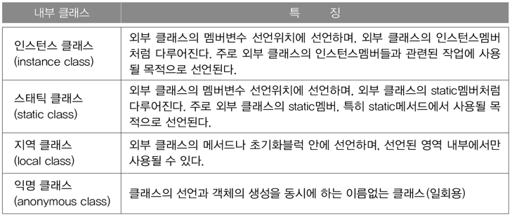

# 내부 클래스(inner class)

## 내부 클래스란?

* 내부 클래스는 클래스 내에 선언된 클래스이다.  
  클래스 내에 다른 클래스를 선언하는 이유는 두 클래스가 서로 긴밀한 관계에 있기 때문이다.
  
* 내부 클래스의 장점
  * 두 클래스의 멤버들 간에 서로 쉽게 접근할 수 있다.
  * 외부에는 불필요한 클래스를 감춤으로써 코드의 복잡성을 줄일 수 있다. (캡슐화)

```java
class A {         // 외부 클래스(outer class)
    ...
    class B {     // 내부 클래스(inner class)
        ...
    }
    ...
}
```

* 이 때 내부 클래스인 B는 외부 클래스인 A를 제외하고는 다른 클래스에서 잘 사용되지 않는 것이어야 한다.

## 내부 클래스의 종류와 특징

* 내부 클래스의 종류는 변수의 선언위치에 따른 종류와 같다.



## 내부 클래스의 선언

```java
class Outer {
    class InstanceInner {}
    static class StaticInner {}
    
    void method() {
        class LocalInner {}
    }
}
```

## 내부 클래스의 제어자와 접근성

* 내부 클래스도 클래스이기 때문에 abstract나 final과 같은 제어자를 사용할 수 있을 뿐만 아니라,  
  멤버변수들처럼 private, protected와 같은 접근 제어자도 사용이 가능하다.
  
```java
class Outer {
    private class InstanceInner {}
    protected static class StaticInner {}
    
    void method() {
        class LocalInner {}
    }
}
```

```java
class Outer {
    class InstanceInner {
        int iv = 100;
//      static int cv = 100;                // 에러. static 변수를 선언할 수 없다.
        final static int CONST = 100;       // final static은 상수이므로 허용.

        void InstanceMethod() {}
//      static void staticMethod() {}       // 에러. static 메소드를 선언할 수 없다.
    }

    static class StaticInner {
        int iv = 200;
        static int cv = 200;                // static 클래스만 static 멤버를 정의할 수 있다.
        final static int CONST = 200;

        void InstanceMethod() {}
        static void staticMethod() {}       // static 클래스만 static 멤버를 정의할 수 있다.
    }

    void method() {
        class LocalInner {
            int iv = 300;
//          static int cv = 300;
            final static int CONST = 300;

            void InstanceMethod() {}
//          static void staticMethod() {}
        }
    }

    public static void main(String[] args) {
        System.out.println(InstanceInner.CONST);
        System.out.println(StaticInner.cv);
    }
}
```

* 내부 클래스 중에서 static 클래스(StaticInner)만 static 멤버를 가질 수 있다.  
  드문 경우지만 내부 클래스에 static 변수를 선언해야한다면 static 클래스로 선언해야 한다.

* 다만 final static 변수는 상수이므로 모든 내부 클래스에서 정의가 가능하다.

```java
public class Outer {
    class InstanceInner {}
    static class StaticInner {}

    InstanceInner iv1 = new InstanceInner();
    StaticInner iv2 = new StaticInner();

//  static InstanceInner cv1 = new InstanceInner();     // static 멤버는 인스턴스 멤버에 직접 접근할 수 없다.
    static StaticInner cv2 = new StaticInner();

    void instanceMethod() {
        // 인스턴스 메소드에서는 인스턴스 멤버와 static 멤버 모두 접근 가능하다.
        InstanceInner obj1 = new InstanceInner();
        StaticInner obj2 = new StaticInner();

        class LocalInner {}
        LocalInner lv = new LocalInner();
    }

    static void staticMethod() {
//      InstanceInner obj1 = new InstanceInner();       // static 메소드는 인스턴스 멤버에 직접 접근할 수 없다.
        StaticInner obj2 = new StaticInner();

        // 굳이 접근하려면 아래와 같이 외부 클래스의 인스턴스를 생성해야 한다.
        // 인스턴스 클래스는 외부 클래스를 먼저 생성해야만 생성할 수 있다.
        Outer outer = new Outer();
        InstanceInner obj1 = outer.new InstanceInner();

        class LocalInner {}
        LocalInner lv = new LocalInner();
    }
}
```

* 인스턴스 멤버는 같은 클래스에 있는 인스턴스 멤버와 static 멤버 모두 직접 호출이 가능하지만,  
  static 멤버는 인스턴스 멤버를 직접 호출할 수 없다.

* 마찬가지로 인스턴스 클래스는 외부 클래스의 인스턴스 멤버를 객체 생성없이 바로 사용할 수 있지만,  
  스태틱 클래스는 외부 클래스의 인스턴스 멤버를 객체 생성없이 사용할 수 없다.

```java
public class Outer {
    private int outerIv = 0;
    static int outerCv = 0;

    class InstanceInner {
        int iiv1 = outerIv;         // 외부 클래스의 private 멤버도 접근가능하다.
        int iiv2 = outerCv;
    }

    static class StaticInner {
//      int siv = outerIv;          // 스태틱 클래스는 외부 클래스의 인스턴스 멤버에 접근할 수 없다.
        static int scv = outerCv;
    }

    void instanceMethod() {
        int lv = 0;
        final int LV = 0;           // JDK 1.8부터 final 생략 가능

        class LocalInner {
            int liv1 = outerIv;
            int liv2 = outerCv;

//          int liv3 = lv;          // 에러. 외부 클래스의 지역변수는 final이 붙은 변수만 접근가능하다.(JDK1.8부터 에러 아님)
            int liv4 = LV;          // OK
        }
    }

    static void staticMethod() {
        int lv = 0;
        final int LV = 0; // JDK 1.8부터 final 생략 가능
        
        class LocalInner {
//          int liv1 = outerIv;     // 에러. 스태틱 메소드는 외부 클래스의 인스턴스 멤버에 접근할 수 없다.
            int liv2 = outerCv;

//          int liv3 = lv;          // 에러. 외부 클래스의 지역변수는 final이 붙은 변수만 접근가능하다.(JDK1.8부터 에러 아님)
            int liv4 = LV;          // OK
        }
    }
}
```

* 내부 클래스에서 외부 클래스의 변수들에 대한 접근성을 보여주는 예제이다.

* 인스턴스 클래스(InstanceInner)는 외부 클래스(Outer)의 인스턴스 멤버이기 때문에 인스턴스 변수 outerIv와 static 변수 outerCv를  
  모두 사용할 수 있다. 심지어는 outerIv의 접근 제어자가 private일지라도 사용가능하다.
  
* 스태틱 클래스(StaticInner)는 외부 클래스(Outer)의 static 멤버이기 때문에 외부 클래스의 인스턴스 멤버인  
  outerIv와 InstanceInner를 사용할 수 없다. 단지 static 멤버인 outerCv만을 사용할 수 있다.
  
* 인스턴스 메소드에 선언된 지역 클래스(LocalInner)는 외부 클래스의 인스턴스 멤버와 static 멤버를 모두 사용할 수 있으며,  
  지역 클래스가 포함된 메소드에 정의된 지역 변수도 사용할 수 있다.
  
* 스태틱 메소드에 선언된 지역 클래스(LocalInner)는 외부 클래스의 static 멤버만 사용할 수 있으며,  
  지역 클래스가 포함된 메소드에 정의된 지역 변수도 사용할 수 있다.
  
* 단, final이 붙은 지역변수만 접근가능한데 그 이유는 메소드가 수행을 마쳐서 지역변수가 소멸된 시점에도,  
  지역 클래스의 인스턴스가 소멸된 지역 변수를 참조하려는 경우가 발생할 수 있기 때문이다.
  
* JDK 1.8부터 지역 클래스에서 접근하는 지역 변수 앞에 final을 생략할 수 있게 바뀌었다. 대신 컴파일러가 자동으로 붙여준다.  
  즉, 편의상 final을 생략할 수 있게 한 것일 뿐 해당 변수의 값이 바뀌는 문장이 있으면 컴파일 에러가 발생한다.

```java
class Outer {
    class InstanceInner {
        int iv = 100;
    }

    static class StaticInner {
        int iv = 200;
        static int cv = 300;
    }
    
    void instanceMethod() {
        class LocalInner {
            int iv = 400;
        }
    }
}

class Example {
    public static void main(String[] args) {
        // 인스턴스 내부 클래스의 인스턴스를 생성하려면 외부 클래스의 인스턴스를 먼저 생성해야 한다.
        Outer outer = new Outer();
        Outer.InstanceInner ii = outer.new InstanceInner();

        System.out.println("ii.iv : " + ii.iv);

        // 스태틱 내부 클래스의 인스턴스는 외부 클래스를 먼저 생성하지 않아도 된다.
        Outer.StaticInner si = new Outer.StaticInner();

        System.out.println("si.iv : " + si.iv);
        System.out.println("Outer.StaticInner.cv : " + Outer.StaticInner.cv);
    }
}
```

```
ii.iv : 100
si.iv : 200
Outer.StaticInner.cv : 300
```

* 외부 클래스가 아닌 다른 클래스에서 내부 클래스를 생성하고 내부 클래스의 멤버에 접근하는 예제이다.  
  실제로 이런 경우가 발생했다는 것은 내부 클래스로 선언해서는 안되는 클래스를 내부 클래스로 선언했다는 의미이다.
  
* 참고로 컴파일 시 생성되는 클래스 파일은 다음과 같다.

```
Example.class
Outer.class
Outer$InstanceInner.class
Outer$StaticInner.class
Outer$1LocalInner.class
```

* 컴파일 했을 때 생성되는 파일명은 **'외부 클래스명$내부 클래스명.class'** 형식으로 되어있다.
* 지역 내부 클래스는 다른 메소드에 같은 이름의 내부 클래스가 존재할 수 있기 때문에 내부 클래스명 앞에 숫자가 붙는다.

```java
class Outer {
    void method1() {
      class LocalInner {}
    }

    void method2() {
      class LocalInner {}
    }
}
```

* 위 코드를 컴파일 하면 다음과 같은 클래스 파일이 생성될 것이다.

```
Outer.class
Outer$1LocalInner.class
Outer$2LocalInner.class
```

```java
class Outer {
    int value = 10;             // Outer.this.value

    class Inner {
        int value = 20;         // this.value

        void method() {
            int value = 30;     // value

            System.out.println("value : " + value);
            System.out.println("this.value : " + this.value);
            System.out.println("Outer.this.value : " + Outer.this.value);
        }
    }
}

class Example {
    public static void main(String[] args) {
        new Outer().new Inner().method();
    }
}
```

```
value : 30
this.value : 20
Outer.this.value : 10
```

* 내부 클래스와 외부 클래스에 선언된 변수의 이름이 같을 때 변수 앞에 **'this'** 또는 **'외부 클래스명.this'** 를 붙여서 구별할 수 있다.

## 익명 클래스(anonymous class)

* 익명 클래스는 다른 내부 클래스들과는 달리 이름이 없다.
* 클래스의 선언과 객체의 생성을 동시에 하기 때문에 단 한번만 사용될 수 있고 하나의 객체만을 생성할 수 있는 일회용 클래스이다.

```java
new 조상클래스이름() {
    // 멤버 선언
}

new 구현인터페이스이름() {
    // 멤버 선언
}
```

* 이름이 없기 때문에 생성자도 가질 수 없으며, 조상 클래스의 이름이나 구현하고자 하는 인터페이스의 이름을 사용해서  
  정의하기 때문에 하나의 클래스를 상속받는 동시에 인터페이스를 구현하거나 둘 이상의 인터페이스를 구현할 수 없다.

* 오직 단 하나의 클래스를 상속받거나 단 하나의 인터페이스만을 구현할 수 있다.

```java
class Outer {
    Object iv = new Object() { void method() {} };
    static Object cv = new Object() { void method() {} };

    void method() {
        Object lv = new Object() { void method() {} };
    }
}
```

* 이 예제를 컴파일하면 다음과 같이 4개의 클래스 파일이 생성된다.

```
Outer.class
Outer$1.class
Outer$2.class
Outer$3.class
```

* 익명 클래스는 이름이 없기 때문에 **'외부 클래스명$숫자.class** 의 형식으로 클래스 파일명이 결정된다.

```java
class Example {
    public static void main(String[] args) {
        Button b = new Button("Start");
        b.addActionListener(new EventHandler());
    }
}

class EventHandler implements ActionListener {
    public void actionPerformed(ActionEvent e) {
        System.out.println("ActionEvent occurred");
    }
}
```

```java
class Example {
    public static void main(String[] args) {
        Button b = new Button("Start");
        b.addActionListener(new ActionListener() {
            public void actionPerformed(ActionEvent e) {
                System.out.println("ActionEvent occurred");
            }
        });
    }
}
```

# 참고

* [자바의 정석](http://www.kyobobook.co.kr/product/detailViewKor.laf?ejkGb=KOR&mallGb=KOR&barcode=9788994492032&orderClick=LAG&Kc=)
