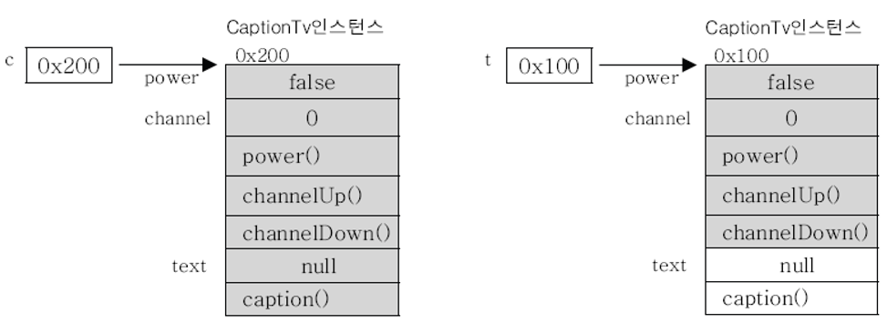

# 다형성(polymorphism)

## 다형성이란?

* 객체지향개념에서 다형성이란 '여러 가지 형태를 가질 수 있는 능력'을 의미한다.
* 자바에서는 한 타입의 참조변수로 여러 타입의 객체를 참조할 수 있도록 함으로써 다형성을 프로그램적으로 구현하였다.
* 이를 좀 더 구체적으로 말하면, **조상 클래스 타입의 참조변수로 자손 클래스의 인스턴스를 참조할 수 있도록 하였다.**

```java
class Tv {
    boolean power;
    int channel;
    
    void power() {}
    void channelUp() {}
    void channelDown() {}
}

class CaptionTv extends Tv {
    String text;
    
    void caption() {}
}

class Example {
    public static void main(String[] args){
        CaptionTv c = new CaptionTv();
        Tv t = new CaptionTv();
    }
}
```

* 이 경우 실제 인스턴스가 CaptionTv 타입이라 할지라도, 참조변수 t로는 CaptionTv 인스턴스의 모든 멤버를 사용할 수 없다.
* Tv 타입의 참조변수로는 CaptionTv 인스턴스 멤버 중에서 Tv 클래스의 멤버들만 사용할 수 있다.
* **둘 다 같은 타입의 인스턴스지만 참조변수의 타입에 따라 사용할 수 있는 멤버가 달라진다.**



* 반대로 아래와 같이 자손타입의 참조변수로 조상타입의 인스턴스를 참조하는 것은 가능할까?

```java
CaptionTv c = new Tv();
```

* 불가능하다. 그 이유는 실제 인스턴스인 Tv의 멤버 개수보다 참조변수 c가 사용할 수 있는 멤버 개수가 더 많기 때문이다.
* 참조변수 c로는 c가 참조하고 있는 인스턴스에서 text와 caption()을 사용하려 할 수 있다.
* 하지만 c가 참조하고 있는 인스턴스는 Tv 타입이고, Tv 인스턴스에는 text와 caption()이 존재하지 않기 때문에 문제가 발생한다.
* **자손타입의 참조변수로 조상타입의 인스턴스를 참조하는 것은 존재하지 않는 멤버를 사용할 가능성이 있으므로 허용하지 않는다.**

```
조상타입의 참조변수로 자손타입의 인스턴스를 참조할 수 있다.
자손타입의 참조변수로 조상타입의 인스턴스를 참조할 수 없다.
```

## 참조변수의 형변환

* 서로 상속관계에 있는 클래스사이에서만 참조변수도 형변환이 가능하다.
* 형변환은 참조변수의 타입을 변환하는 것이지 인스턴스를 변환하는 것은 아니기 때문에  
  참조변수의 형변환은 인스턴스에 아무런 영향을 미치지 않는다.
* 단지 참조하고 있는 인스턴스에서 사용할 수 있는 멤버의 범위(개수)를 조절하는 것 뿐이다.

```
자손타입 -> 조상타입 (Up-casting) : 형변환 생략가능
자손타입 <- 조상타입 (Down-casting) : 형변환 생략불가
```

```java
class Car {
    String color;
    int door;
    
    void drive() { System.out.println("drive"); }
    void stop() { System.out.println("stop"); }
}

class FireEngine extends Car {
    void water() { System.out.println("water"); }
}

class Example {
    public static void main(String[] args) {
        Car car;
        FireEngine fe = new FireEngine();
        
        fe.water();
        
        car = fe;               // 자손타입 -> 조상타입 (Up-casting)        
//      car.water();            // 컴파일 에러. Car 타입의 참조변수로는 water()를 호출할 수 없다.

        fe = (FireEngine)car;   // 자손타입 <- 조상타입 (Down-casting)
        fe.water();
    }
}
```

```
water
water
```

* **자손타입의 참조변수로 조상타입의 인스턴스를 참조하는 것은 존재하지 않는 멤버를 사용할 가능성이 있으므로 허용하지 않는다.**
* **조상타입의 참조변수를 자손타입의 참조변수로 형변환하는 down-casting이 가능하다.**
```
자손타입 참조변수 = 조상타입 참조변수 (O)
자손타입 참조변수 = 조상타입 인스턴스 (X)
```
* 위 두 문장이 햇갈릴 수도 있는데 아래의 예제를 보자.

```java
class Example {
    public static void main(String[] args) {
        Car car = new Car();
        FireEngine fe;
        
        fe = (FireEngine)car;
    }
}
```

* 두 번째 예제는 컴파일은 성공하지만, `fe = (FireEngine)car` 문장에서 런타임 에러가 발생한다.  
  첫 번째 예제의 `fe = (FireEngine)car` 문장과의 차이점을 생각해보자.

* 우선 위 문장은 **'조상타입의 참조변수를 자손타입의 참조변수로 형변환하는 down-casting이 가능하다'** 는 조건을 만족하고 있다.  
  그러나,

* 첫 번째 예제의 `fe = (FireEngine)car` 에서 car 참조변수는 FireEngine 인스턴스를 참조하고 있고,  
  두 번째 예제의 `fe = (FireEngine)car` 에서 car 참조변수는 Car 인스턴스를 참조하고 있다.
  
* 두 번째 예제는 **자손타입의 참조변수로 조상타입의 인스턴스를 참조하는 것은 불가능하다.** 는 조건을 만족하지 못한다.  
  따라서 두 번째 예제에서는 에러가 발생한다.

* 컴파일 에러가 아닌 런타임 에러가 발생하는 이유
  * 컴파일 타임에는 참조변수간의 타입만 체크하기 때문에 런타임에 car 참조변수가 실제로 참조하고 있을 인스턴스의 타입에  
    대해서는 전혀 알지 못한다. 그래서 컴파일 타임에는 에러가 발생하지 않는다.
  * 그러나 런타임에 자손타입 참조변수(fe)로 조상타입 인스턴스(Car)를 참조하게 되어 에러가 발생한다.

```java
class A {}
class B extends A {}
class C extends B {}
class D extends C {}

class Example {
    public static void main(String[] args) {
        A a;
        ...
        C c = (C)a;
        ...
    }
}
```
* `C c = (C)a;` 코드에서 조상타입의 참조변수를 자손타입의 참조변수로 형변환하고 있다. (down-casting)

* 런타임에 `C c = (C)a;` 코드에서 참조변수 a가 참조하고 있을 인스턴스는 A 혹은 자손인 B, C, D 인스턴스일 것이다.
  * **case 1 : 참조변수 a가 A or B 인스턴스를 참조하고 있는 경우**
    * C 타입 참조변수 c가 조상타입인 A 또는 B 인스턴스를 참조하게 되므로 런타임 에러가 발생한다.
  * **case 2 : 참조변수 a가 C or D 인스턴스를 참조하고 있는 경우**
    * C 타입 참조변수 c가 자신(C) 또는 자손타입인 D 인스턴스를 참조하게 되므로 런타임 에러가 발생하지 않는다.

* case 1 문제가 발생할 가능성이 있기 때문에 down-casting은 형변환을 생략할 수 없으며, 형변환을 수행하기 전에  
  instanceof 연산자를 사용해서 참조변수가 참조하고 있는 실제 인스턴스의 타입을 확인하는 것이 안전하다.
  
* 자손타입의 참조변수를 조상타입의 참조변수로 형변환하는 up-casting의 경우 ex) `a = c;`  
  조상타입 참조변수 a가 자손타입 인스턴스를 참조하게 될 것이라는 보장이 있기 때문에 형변환을 생략할 수 있다.

## instanceof 연산자

* `참조변수 instanceof 타입(클래스명)`
* 참조변수가 참조하고 있는 인스턴스의 형변환 여부를 알아보기 위해 instanceof 연산자를 사용한다.
* 연산결과로 true를 얻었다는 것은 참조변수가 검사한 타입으로 형변환이 가능하다는 것을 뜻한다.
* 값이 null인 참조변수에 대해 instanceof 연산을 수행하면 false를 결과로 얻는다.

```java
class Example {
    public static void main(String[] args){
        FireEngine fe = new FireEngine();

        if(fe instanceof FireEngine)
            System.out.println("This is a FireEngine instance");

        if(fe instanceof Car)
            System.out.println("This is a Car instance");

        if(fe instanceof Object)
            System.out.println("This is an Object instance");

        System.out.println(fe.getClass().getName());
    }
}
```

```
This is a FireEngine instance
This is a Car instance
This is an Object instance
FireEngine
```

* 오른쪽 피연산자가 참조변수가 참조하고 있는 인스턴스의 타입과 같거나 조상타입이라면 true를 반환한다.

## 참조변수와 인스턴스의 연결

* 조상 클래스의 멤버변수와 같은 이름의 변수를 자손 클래스에 중복으로 정의한 경우,  
  조상타입의 참조변수로 자손 인스턴스를 참조했을 때는 조상 클래스에 선언된 멤버변수가 사용되고,  
  자손타입의 참조변수로 자손 인스턴스를 참조했을 때는 자손 클래스에 선언된 멤버변수가 사용된다.

* 조상 클래스의 인스턴스 메소드를 자손 클래스에서 오버라이딩한 경우  
  참조변수의 타입에 관계없이 항상 실제 인스턴스의 인스턴스 메소드(오버라이딩된 메소드)가 호출된다.

* 조상 클래스의 static 메소드와 같은 이름의 static 메소드를 자손 클래스에 정의할 수 있지만  
  이것은 각 클래스에 별개의 static 메소드를 정의한 것일 뿐 오버라이딩이 아니다. 따라서,
  
  조상타입의 참조변수로 자손 인스턴스를 참조했을 때는 조상 클래스에 선언된 static 메소드가 사용되고,  
  자손타입의 참조변수로 자손 인스턴스를 참조했을 때는 자손 클래스에 선언된 static 메소드가 사용된다.
  
* static 멤버는 항상 클래스이름.클래스멤버 방식으로 사용하자.

```java
class Parent {
	int iv = 1;
	static int cv = 10;
	
	void instanceMethod() { System.out.println("parent instance method"); }
	static void staticMethod() { System.out.println("parent static method"); }
}

class Child extends Parent {
	int iv = 2;
	static int cv = 20;
	
	void instanceMethod() { System.out.println("child instance method"); } 
	static void staticMethod() { System.out.println("child static method"); }
}

class Example {
    public static void main(String[] args){
        Parent p = new Child();
        Child c = new Child();

        System.out.println("p.iv : " + p.iv);
        System.out.println("c.iv : " + c.iv);

        System.out.println("p.cv : " + p.cv);
        System.out.println("c.cv : " + c.cv);

        p.instanceMethod();
        c.instanceMethod();

        p.staticMethod();
        c.staticMethod();
    }
}
```

```
p.iv : 1
c.iv : 2
p.cv : 10
c.cv : 20
child instance method
child instance method
parent static method
child static method
```

```java
class Parent {
    int x = 100;

    void method() { System.out.println("parent method"); }
}

class Child extends Parent {
    int x = 200;

    void method() { 
        System.out.println("x : " + x);
        System.out.println("this.x : " + this.x);
        System.out.println("super.x : " + super.x);
    }
}

class Example {
    public static void main(String[] args){
        Parent p = new Child();
        Child c = new Child();

        System.out.println(p.x);
        p.method();

        System.out.println();

        System.out.println(c.x);
        c.method();
    }
}
```

```
100
x : 200
this.x : 200
super.x : 100

200
x : 200
this.x : 200
super.x : 100
```

* 조상 클래스의 멤버변수와 같은 이름의 변수를 자손 클래스에 중복으로 정의한 경우,  
  조상타입의 참조변수로 자손 인스턴스를 참조했을 때는 조상 클래스에 선언된 멤버변수가 사용된다.
  
* 따라서 조상타입의 참조변수로 자손 클래스에 선언된 멤버변수에 접근할 수 없지만,  
  오버라이딩된 메소드를 이용하여 간접적으로 접근할 수는 있다. (실행결과 2번째 줄)

## 매개변수의 다형성

* 참조변수의 다형성은 메소드의 매개변수에도 적용된다.

```java
class Product {                     // 제품
    int price;                      // 제품의 가격
    int bonus;                      // 제품 구매시 제공하는 보너스 점수
}

class Tv extends Product {}
class Audio extends Product {}
class Computer extends Product {}

class Buyer {                       // 고객
    int money = 1000;               // 소유 금액
    int bonus = 0;                  // 소유 보너스 점수
}
```

* Buyer 클래스에 물건을 구입하는 메소드를 추가해보자. 구입할 대상이 필요하므로 매개변수로 구입할 제품을 넘겨받아야 한다.  
  Tv를 구입할 수 있도록 매개변수를 Tv 타입으로 하였다.

```java
class Buyer {
    int money = 1000;
    int bonus = 0;
    
    void buy(Tv t) {
        money -= t.price;
        bonus += t.bonus;
    }
}
```

* 그런데 buy(Tv t) 메소드로는 Tv 밖에 구입할 수 없기 때문에 다른 제품들도 구입할 수 있는 메소드가 추가로 필요하다.

```java
void buy(Audio a) {
    money -= a.price;
    bonus += a.bonus;
}

void buy(Computer c) {
    money -= c.price;
    bonus += c.bonus;
}
```

* 이렇게 되면, 제품의 종류가 늘어날 때마다 Buyer 클래스에 새로운 buy 메소드를 추가해주어야 한다.
* 그러나 메소드의 매개변수에 다형성을 적용하면 하나의 메소드로 간단히 처리할 수 있다.

```java
void buy(Product p) {
    money -= p.price;
    bonus += p.bonus;
}
```

* Product 클래스의 자손타입의 인스턴스면 어느 것이나 buy(Product p) 메소드의 매개변수로 받아들일 수 있다.
* 다른 제품 클래스를 추가할 때 Product 클래스를 상속받기만 하면, buy(Product p) 메소드의 매개변수로 받아들여질 수 있다.

```java
Buyer b = new Buyer();

b.buy(new Tv());
b.buy(new Audio());
b.buy(new Computer());
```

## 여러 종류의 객체를 배열로 다루기

# 참고
