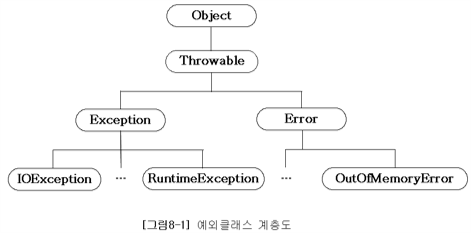
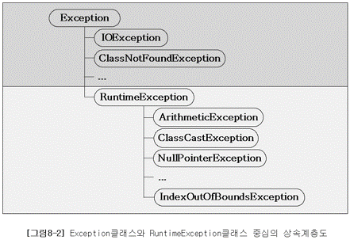

# 예외처리(exception handling)

## 프로그램 오류

프로그램이 실행 중 어떤 원인에 의해서 오작동을 하거나 비정상적으로 종료되는 경우가 있다.  
이러한 결과를 초래하는 원인을 프로그램 에러 또는 오류라고 한다.

* 컴파일 에러 : 컴파일 시에 발생하는 에러
* 런타임 에러 : 프로그램의 실행도중에 발생하는 에러
  * 에러(error) : 프로그램 코드에 의해서 수습될 수 없는 심각한 오류
    * OutOfMemoryError, StackOverflowError 등
  * 예외(exception) : 프로그램 코드에 의해서 수습될 수 있는 다소 미약한 오류
* 논리적 에러 : 컴파일도 잘되고 실행도 잘되지만 의도와 다르게 동작하는 에러
  * 창고의 재고가 음수가 된다던가, 게임 프로그램에서 비행기가 죽지 않는 경우

에러가 발생하면 프로그램의 비정상적인 종료를 막을 길이 없지만,  
예외는 발생하더라도 프로그래머가 이에 대한 적절한 코드를 미리 작성해 놓음으로써 프로그램의 비정상적인 종료를 막을 수 있다.

## 예외 클래스의 계층구조

* 자바에서는 실행시 발생할 수 있는 오류(Exception과 Error)를 클래스로 정의하였다.



* 모든 예외의 최고 조상은 Exception 클래스이며, 상속계층도를 Exception 클래스부터 도식화하면 다음과 같다.



* 위 그림에서 볼 수 있듯이 예외 클래스들은 다음과 같이 두 그룹으로 나눠질 수 있다.

```
1. Exception 클래스와 그 자손들 (그림 8-2의 윗부분, RuntimeException 클래스와 그 자손들 제외)
2. RuntimeException 클래스와 그 자손들 (그림 8-2의 아랫부분)
```

*	Exception 클래스
	* 주로 외부의 영향으로 발생할 수 있는 것들로서, 프로그램의 사용자들의 동작에 의해서 발생하는 경우가 많다.
		* 존재하지 않는 파일의 이름을 입력하는 경우 (FileNotFoundException)
		* 클래스의 이름을 잘못 적은 경우 (ClassNotFoundException)
		* 입력한 데이터 형식이 잘못된 경우 (DataFormatException)
*	RuntimeException 클래스
	* 주로 프로그래머의 실수에 의해서 발생될 수 있는 예외들로 자바의 프로그래밍 요소와 관계가 깊다.
		* 배열의 범위를 벗어나는 경우 (ArrayIndexOutOfBoundsException)
		* 값이 null인 참조변수의 멤버를 호출하는 경우 (NullPointerException)
		* 클래스간의 형변환을 잘못하는 경우 (ClassCastException)
		* 정수를 0으로 나누려고하는 경우(ArithmeticException)

## 예외처리하기 - try-catch문

* 프로그램의 실행도중에 발생하는 에러는 어쩔 수 없지만, 예외는 프로그래머가 이에 대한 처리를 미리 해주어야 한다.

```
예외처리(exception handling)
정의 - 프로그램 실행 시 발생할 수 있는 예외에 대비한 코드를 작성하는 것
목적 - 프로그램의 비정상 종료를 막고, 정상적인 실행상태를 유지하는 것
```

* 발생한 예외를 처리하지 못하면, 프로그램은 비정상적으로 종료되며, 처리되지 못한 예외(uncaught exception)는  
  JVM의 '예외 처리기(UncaughtExceptionHandler)'가 받아서 예외의 원인을 화면에 출력한다.

* 예외를 처리하기 위해서는 try-catch문을 사용하며, 그 구조는 다음과 같다.

```java
try {
    // 예외가 발생할 가능성이 있는 문장들을 넣는다.
} catch(Exception1 e1) {
    // Exception1이 발생했을 경우, 이를 처리하기 위한 문장을 넣는다.
} catch(Exception2 e2) {
    // Exception2가 발생했을 경우, 이를 처리하기 위한 문장을 넣는다.
} catch(ExceptionN eN) {
    // ExceptionN이 발생했을 경우, 이를 처리하기 위한 문장을 넣는다.
}
```

* if문과 달리, try 블럭이나 catch 블럭 내에 포함된 문장이 하나뿐이어도 괄호{}를 생략할 수 없다.

```java
public class Example {
    public static void main(String[] args) {
        try {
            try {} catch(Exception e) {}
        } catch(ArithmeticException e) {
//          try {} catch(Exception e) {} // 에러. 변수 e가 중복 선언되었다.
        } catch(Exception e) {
        
        }
        
        try {

        } catch(Exception e) {

        }
    }
}
```

* 하나의 메소드 내에 여러 개의 try-catch문이 사용될 수 있으며, try 블럭 또는 catch 블럭에 또 다른 try-catch문이 포함될 수 있다.
* catch 블럭의 괄호에 선언된 변수는 catch 블럭 내에서만 유효하기 때문에, 모든 catch 블럭에 참조변수 'e' 하나 만을 사용해도 된다.

```java
public class Example {
    public static void main(String[] args) {
        int number = 100;
        int result = 0;

        for(int i = 0; i < 10; i++) {
            result = number / (int)(Math.random() * 10);
            System.out.println(result);
        }
    }
}
```

```
33
12
Exception in thread "main" java.lang.ArithmeticException: / by zero
	at Example.main(Example.java:7)
```

* ArithmeticException은 산술연산과정에서 오류가 있을 때 발생하는 예외이며,  
  정수는 0으로 나누는 것이 금지되어있기 때문에 예외가 발생했다.

```java
public class Example {
    public static void main(String[] args) {
        int number = 100;
        int result = 0;

        for(int i = 0; i < 10; i++) {
            try {
                result = number / (int)(Math.random() * 10);
                System.out.println(result);
            } catch(ArithmeticException e) {
                System.out.println("0");
            }
        }
    }
}
```

```
33
20
16
0   <- ArithmeticException이 발생해서 0이 출력되었다.
12
33
14
14
50
100
```

* 만일 예외처리를 하지 않았다면, 세 번째 줄까지만 출력되고 예외가 발생해서 프로그램이 비정상적으로 종료되었을 것이다.

## try-catch문에서의 흐름

* try 블럭 내에서 예외가 발생한 경우
  * 발생한 예외와 일치하는 catch 블럭이 있는지 확인한다.
  * 일치하는 catch 블럭을 찾게 되면, 그 catch 블럭 내의 문장들을 수행하고 전체 try-catch문을 빠져나가서  
    그 다음 문장을 계속해서 수행한다. 만일 일치하는 catch 블럭을 찾지 못하면, 예외는 처리되지 못한다.
* try 블럭 내에서 예외가 발생하지 않은 경우
  * catch 블럭을 거치지 않고 전체 try-catch문을 빠져나가서 수행을 계속한다.

```
try 블럭에서 예외가 발생하면, 예외가 발생한 위치 이후에 있는 try 블럭의 문장들은 수행되지 않으므로,
try 블럭에 포함시킬 코드의 범위를 잘 선택해야한다.
```

## 예외의 발생과 catch 블럭

* 예외가 발생하면, 발생한 예외에 해당하는 클래스의 인스턴스가 만들어 진다.
* 예외가 발생한 문장이 try 블럭에 포함되어 있다면, 이 예외를 처리할 수 있는 catch 블럭이 있는지 찾게 된다.
* 첫 번째 catch 블럭부터 차례로 내려가면서 생성된 예외 클래스의 인스턴스와 catch 블럭 괄호() 내에 선언된 참조변수의 타입에
  instanceof 연산자를 이용해서 검사하게 되는데, 검사결과가 true인 catch 블럭을 만날 때까지 검사는 계속된다.
* 검사결과가 true인 catch 블럭을 찾게 되면 블럭에 있는 문장들을 모두 수행한 후에 try-catch문을 빠져나가고 예외는 처리되지만,  
  검사결과가 true인 catch 블럭이 하나도 없으면 예외는 처리되지 않는다.
  
```java
public class Example {
    public static void main(String[] args) {
        System.out.println(1);
        System.out.println(2);

        try {
            System.out.println(3);
            System.out.println(0/0);
            System.out.println(4);      // 실행되지 않는다.
        } catch(Exception e) {          // ArithmeticException 대신 Exception을 사용.
            System.out.println(5);

            if(e instanceof ArithmeticException)
                System.out.println("true");
        }

        System.out.println(6);
    }
}
```

```
1
2
3
5
true
6
```

* 모든 예외 클래스는 Exception 클래스의 자손이므로, catch 블럭의 괄호()에 Exception 클래스 타입의 참조변수를 선언해 놓으면  
  어떤 종류의 예외가 발생하더라도 이 catch 블럭에 의해서 처리된다.

* ArithmeticException 클래스는 Exception 클래스의 자손이므로 ArithmeticException 인스턴스와 Exception 클래스와의  
  instanceof 연산결과가 true가 되어 catch 블럭의 문장들이 수행되고 예외가 처리된다.

```java
try {

} catch(ArithmeticException e) {

} catch(Exception e) {

}
```

* 위 코드처럼, try-catch문의 마지막에 Exception 클래스 타입의 참조변수를 선언한 catch 블럭을 사용하면,  
  ArithmeticException이 아닌 다른 어떤 종류의 예외가 발생하더라도 이 catch 블럭에 의해 처리되도록 할 수 있다.

### printStackTrace()와 getMessage()

* 예외가 발생했을 때 생성되는 예외 클래스의 인스턴스에는 발생한 예외에 대한 정보가 담겨 있으며,  
  printStackTrace()와 getMessage() 메소드를 통해서 이 정보들을 얻을 수 있다.
  
```
printStackTrace() : 예외발생 당시의 호출 스택(Call Stack)에 있었던 메소드의 정보와 예외 메시지를 화면에 출력한다.
getMessage() : 발생한 예외 클래스의 인스턴스에 저장된 메시지를 얻을 수 있다.
```

```java
public class Example {
    public static void main(String[] args) {	
        System.out.println(1);
        System.out.println(2);

        try {
            System.out.println(3);
            System.out.println(0/0);
            System.out.println(4);
        } catch(ArithmeticException ae) {
            ae.printStackTrace();
            System.out.println("예외 메시지 : " + ae.getMessage());
        }

        System.out.println(6);
    }
}
```

```
1
2
3
java.lang.ArithmeticException: / by zero
	at Example.main(Example.java:8)
예외 메시지 : / by zero
6
```

* 이처럼 try-catch문으로 예외처리를 하여 예외가 발생해도 비정상적으로 종료하지 않도록 해주는 동시에,  
  printStackTrace() 또는 getMessage()와 같은 메소드를 통해서 예외의 발생원인을 알 수 있다.

### 멀티 catch 블럭

* JDK 1.7부터 여러 catch 블럭을 '|' 기호를 이용해서, 하나의 catch 블럭으로 합칠 수 있게 되었으며, 이를 '멀티 catch 블럭' 이라 한다.
  * '멀티 catch 블럭'을 이용하면 중복된 코드를 줄일 수 있다.
  * '|' 기호로 연결할 수 있는 예외 클래스의 개수에는 제한이 없다.
  * 멀티 catch 블럭에 사용되는 '|'는 논리 연산자가 아니라 기호이다.

```java
try {
    ...
} catch(ExceptionA e) {
    e.printStackTrace();
} catch(ExceptionB e) {
    e.printStackTrace();
}
```

```java
try {
    ...
} catch(ExceptionA | ExceptionB e) {
    e.printStackTrace();
}
```

* 만일 '|' 기호로 연결된 예외 클래스가 조상과 자손의 관계에 있다면 컴파일 에러가 발생한다.

```java
try {
    ...
} catch(ChildException | ParentException e) {   // 컴파일 에러.
    e.printStackTrace();
}
```

* 왜냐하면, 두 예외 클래스가 조상과 자손의 관계에 있다면, 그냥 다음과 같이 조상 클래스만 써주는 것과 똑같기 때문이다.  
  불필요한 코드는 제거하라는 의미에서 에러가 발생하는 것이다.

```java
try {
    ...
} catch(ParentException e) {
    e.printStackTrace();
}
```

* 그리고 멀티 catch 블럭은 하나의 catch 블럭으로 여러 예외를 처리하는 것이기 때문에, 발생한 예외를 처리하게 되었을 때,  
  멀티 catch 블럭 내에서는 실제로 어떤 예외가 발생한 것인지 알 수 없다.
  
* 그래서 참조변수 e로 '|' 기호로 연결된 예외 클래스들의 공통 분모인 조상 예외 클래스에 선언된 멤버만 사용할 수 있다.

```java
try {
    ...
} catch(ExceptionA | ExceptionB e) {
//  e.methodA();    // 에러. ExceptionA에 선언된 methodA()는 호출 불가.
    
    if(e instanceof ExceptionA) {
        ExceptionA e1 = (ExceptionA)e;
        e1.methodA();
    } else {
        ExceptionB e2 = (ExceptionB)e;
        e2.methodB();
    }
}
```

* 필요하다면, 위와 같이 instanceof로 어떤 예외가 발생한 것인지 확인하고 개별적으로 처리할 수는 있다.  
  그러나 이렇게까지 해가면서 catch 블럭을 합칠 일은 거의 없을 것이다.
  
* 마지막으로 멀티 catch 블럭에 선언된 참조변수 e는 상수이므로 값을 변경할 수 없다는 제약이 있는데,  
  이것은 여러 catch 블럭이 하나의 참조변수를 공유하기 때문에 생기는 제약으로 실제로 참조변수의 값을 바꿀 일은 없을 것이다.

## 예외 발생시키기

* 키워드 throw를 사용해서 프로그래머가 고의로 예외를 발생시킬 수 있다.

```
1. 먼저, 연산자 new를 이용해서 발생시키려는 예외 클래스의 객체를 만든 다음
  - Exception e = new Exception("고의로 발생시켰음");
2. 키워드 throw를 이용해서 예외를 발생시킨다.
  - throw e;
```

```java
public class Example {
    public static void main(String[] args) {	
        try {
            throw new Exception("고의로 발생시켰음.");
        } catch(Exception e) {
            System.out.println("에러 메시지 : " + e.getMessage());
            e.printStackTrace();
        }

        System.out.println("프로그램이 정상 종료되었음.");
    }
}
```

```
에러 메시지 : 고의로 발생시켰음.
java.lang.Exception: 고의로 발생시켰음.
	at Example.main(Example.java:4)
프로그램이 정상 종료되었음.
```

* Exception 인스턴스를 생성할 때, 생성자에 String을 넣어 주면, Exception 인스턴스에 메시지로 저장된다.
  이 메시지는 getMessage()를 이용해서 얻을 수 있다.

```java
public class Example {
    public static void main(String[] args) {	
        throw new Exception();
    }
}
```

```
Example.java:3: error: unreported exception Exception; must be caught or declared to be thrown
                throw new Exception();
                ^
1 error
```

* 이 예제를 작성한 후에 컴파일 하면, 위와 같은 에러가 발생하며 컴파일이 완료되지 않는다.
  예외처리가 되어야 할 부분에 예외처리가 되어 있지 않다는 에러이다.
  
* Exception 클래스들(Exception 클래스와 그 자손들, RuntimeException 제외)이 발생할 가능성이 있는 문장들에 대해  
  예외처리를 해주지 않으면 컴파일조차 되지 않는다.
  
```java
public class Example {
    public static void main(String[] args) {	
        throw new RuntimeException();
    }
}
```

```
Exception in thread "main" java.lang.RuntimeException
	at Example.main(Example.java:3)
```

* 이 예제는 예외처리를 하지 않았음에도 불구하고 이전의 예제와는 달리 성공적으로 컴파일 된다.  
  그러나 실행하면, 위의 실행결과처럼 RuntimeException이 발생하여 비정상적으로 종료된다.
  
* 'RuntimeException 클래스와 그 자손들'에 해당하는 예외는 프로그래머에 의해 실수로 발생하는 것들이기 때문에  
  예외처리를 강제하지 않는다. 만일 RuntimeException 클래스들에 속하는 예외가 발생할 가능성이 있는 코드에도    
  예외처리를 필수로 해야 한다면, 아래와 같이 참조변수와 배열이 사용되는 모든 곳에 예외처리를 해주어야 할 것이다.
  
```java
try {
    int[] arr = new int[10];
    System.out.println(arr[0]);
} catch(ArrayIndexOutOfBoundsException e) {

} catch(NullPointerException e) {

}
```

* 컴파일러가 예외처리를 확인하지 않는 RuntimeException 클래스들은 **'unchecked 예외'** 라고 부르고,  
  컴파일러가 예외처리를 확인하는 Exception 클래스들은 **'checked 예외'** 라고 부른다.

## 메소드에 예외 선언하기

* 예외를 처리하는 방법에는 try-catch문을 사용하는 것 외에, 예외를 메소드에 선언하는 방법이 있다.

```java
void method() throws Exception1, Exception2, ... , ExceptionN {
    ...
}
```

* 모든 예외의 최고 조상인 Exception 클래스를 메소드에 선언하면, 이 메소드는 모든 종류의 예외가 발생할 가능성이 있다는 뜻이다.
* 메소드를 오버라이딩할 때는 단순히 선언된 예외의 개수가 아니라 상속관계까지 고려해야 한다는 점에 주의하자.

```java
void method() throws Exception {
    ...
}
```

* 메소드의 선언부에 예외를 선언함으로써 메소드를 사용하려는 사람이 메소드의 선언부를 보았을 때,  
  이 메소드를 사용하기 위해서는 어떠한 예외들이 처리되어져야 하는지 쉽게 알 수 있다.
  
* 기존의 많은 언어들에서는 메소드에 예외선언을 하지 않기 때문에, 경험 많은 프로그래머가 아니고서는  
  어떤 상황에 어떤 종류의 예외가 발생할 가능성이 있는지 충분히 예측하기 힘들기 때문에 그에 대한 대비를 하는 것이 어려웠다.
  
* 그러나 자바에서는 메소드를 작성할 때 메소드 내에서 발생할 가능성이 있는 예외를 메소드의 선언부에 명시하여  
  이 메소드를 사용하는 쪽에서는 이에 대한 처리를 하도록 강요하기 때문에, 프로그래머들의 짐을 덜어 주는 것은   
  물론이고 보다 견고한 프로그램 코드를 작성할 수 있도록 도와준다.

---

* 메소드에 예외를 선언할 때 일반적으로 RuntimeException 클래스들은 적지 않는다.  
  이 들을 메소드 선언부의 throws에 선언한다고 해서 문제가 되지는 않지만, 보통 반드시 처리해주어야 하는 예외들만 선언한다.

* 사실 예외를 메소드의 throws에 명시하는 것은 예외를 처리하는 것이 아니라, 자신(예외가 발생할 가능성이 있는 메소드)을  
  호출한 메소드에게 예외를 전달하여 예외처리를 떠맡기는 것이다.
  
* 예외를 전달받은 메소드가 또다시 자신을 호출한 메소드에게 전달할 수 있으며, 이런식으로 계속 호출스택에 있는 메소드들을 따라  
  전달되다가 마지막에 있는 main 메소드에서도 예외가 처리되지 않으면, main 메소드마저 종료되어 프로그램 전체가 종료된다.
  
```java
public class Example {
    public static void main(String[] args) throws Exception {	
        method1();
    }

    static void method1() throws Exception {
        method2();
    }

    static void method2() throws Exception {
        throw new Exception();
    }
}
```

```
Exception in thread "main" java.lang.Exception
    at Example.method2(Example.java:11)
    at Example.method1(Example.java:7)
    at Example.main(Example.java:3)
```

* 위의 실행결과를 보면, 프로그램의 실행도중 java.lang.Exception이 발생하여 비정상적으로 종료했다는 것과  
  예외가 발생했을 때 호출 스택(call stack)의 내용을 알 수 있다.
  
* 위의 결과로부터 다음과 같은 사실을 알 수 있다.

```
1. 예외가 발생했을 때, 모두 3개의 메소드(main, method1, method2)가 호출 스택에 있었다.
2. 예외가 발생한 곳은 제일 윗줄에 있는 method2() 이다.
3. main 메소드 -> method1() -> method2() 순서로 호출했다.
```

* 예외가 발생한 메소드에서 예외처리를 하지 않고 자신을 호출한 메소드에게 예외를 넘겨줄 수는 있지만,  
  이것으로 예외가 처리된 것은 아니고 예외를 단순히 전달만 하는 것이다.  
  결국 어느 한 곳에서는 반드시 try-catch문으로 예외처리를 해주어야 한다.
  
```java
public class Example {
    public static void main(String[] args) {	
        method1();
    }

    static void method1() {
        try {
            throw new Exception();
        }catch(Exception e){
            System.out.println("method1() 메소드에서 예외가 처리되었습니다.");
            e.printStackTrace();
        }
    }
}
```

```java
public class Example {
    public static void main(String[] args) {
        try {
            method1();
        }catch(Exception e) {
            System.out.println("main 메소드에서 예외가 처리되었습니다.");
            e.printStackTrace();
        }
    }

    static void method1() throws Exception{
        throw new Exception();
    }
}
```

* 예외가 발생한 메소드 'method1()'에서 예외를 처리할 수도 있고, 예외가 발생한 메소드를 호출한 'main'에서 처리할 수도있다.  
  또는 두 메소드가 예외처리를 분담할 수도 있다.

```java
public class Example {
    public static void main(String[] args) {
        File f = createFile(args[0]);
        System.out.println(f.getName() + " 파일이 성공적으로 생성되었습니다.");
    }

    static File createFile(String fileName) {
        try {
            if(fileName == null || fileName.equals(""))
                throw new Exception();
        } catch(Exception e) {
            fileName = "제목없음.txt";
        } finally {
            File f = new File(fileName);
            createNewFile(f);
            return f;
        }
    }

    static void createNewFile(File f) {
        try {
            f.createNewFile();
        }catch(Exception e) {

        }
    }
}
```

* 이 예제는 예외가 발생한 메소드에서 직접 예외를 처리하도록 되어 있다.

* File 클래스의 createNewFile()은 예외가 선언된 메소드 이므로 finally 블럭 내에 또다시 try-catch문으로 처리해야 한다.  
  간단히 하기 위해 내부적으로 예외처리를 한 createNewFile(File f) 메소드를 만들어서 사용했다.
  
```java
public class Example {
    public static void main(String[] args) {
        try {
            File f = createFile(args[0]);
            System.out.println(f.getName() + " 파일이 성공적으로 생성되었습니다.");
        } catch(Exception e) {
            System.out.println(e.getMessage() + " 다시 입력해 주시기 바랍니다.");
        }
    }

    static File createFile(String fileName) throws Exception {
        if(fileName == null || fileName.equals(""))
            throw new Exception("파일 이름이 유효하지 않습니다.");

        File f = new File(fileName);
        f.createNewFile();
        return f;
    }
}
```

* 이 예제에서는 예외가 발생한 createFile 메소드에서 잘못 입력된 파일 이름을 임의로 처리하지 않고,  
  호출한 main 메소드에게 예외가 발생했음을 알려서 파일 이름을 다시 입력 받도록 하였다.

* File 클래스의 createNewFile()에 대한 예외처리를 하지 않아도 되므로 메소드를 따로 만들지 않았다.

* 이처럼 예외가 발생한 메소드 내에서 자체적으로 처리해도 되는 것은 메소드 내에서 try-catch문을 사용해서 처리하고,  
  **메소드에 호출 시 넘겨받아야 할 값(fileName)을 다시 입력받아야 하는 경우(메소드 내에서 자체적으로 해결이 안 되는 경우)**  
  **에는 예외를 메소드에 선언해서, 호출한 메소드에서 처리해야한다.**

## finally 블럭

* finally 블럭은 예외의 발생여부에 상관없이 실행되어야할 코드를 포함시킬 목적으로 사용된다.  
  try-catch문의 끝에 선택적으로 덧붙여 사용할 수 있으며, try-catch-finally의 순서로 구성된다.
  
```java
try {
    // 예외가 발생할 가능성이 있는 문장들을 넣는다.
} catch(Exception e) {
    // 예외처리를 위한 문장을 적는다.
} finally {
    // 예외의 발생여부에 상관없이 항상 수행되어야하는 문장들을 넣는다.
    // finally 블럭은 try-catch문의 맨 마지막에 위치해야한다.
}
```

* 예외가 발생한 경우에는 'try -> catch -> finally'의 순으로 실행되고,  
  예외가 발생하지 않은 경우에는 'try -> finally'의 순으로 실행된다.
  
```java
public class Example {
    public static void main(String[] args) {
        try {
            startInstall();
            copyFiles();
            deleteTempFiles();
        } catch(Exception e) {
            e.printStackTrace();
            deleteTempFiles();
        }
    }

    static void startInstall() {}
    static void copyFiles() {}
    static void deleteTempFiles() {}
}
```

```java
public class Example {
    public static void main(String[] args) {
        try {
            startInstall();
            copyFiles();
        } catch(Exception e) {
            e.printStackTrace();
        } finally {
            deleteTempFiles();
        }
    }

    static void startInstall() {}
    static void copyFiles() {}
    static void deleteTempFiles() {}
}
```

* 위와 같은 상황에 finally 블럭을 사용하면 좋다.

```java
public class Example {
    public static void main(String[] args) {
        method1();
        System.out.println("method1()의 수행을 마치고 main 메소드로 돌아왔습니다.");
    }

    static void method1() {
        try {
            System.out.println("method1()이 호출되었습니다.");
            return;
        } catch(Exception e) {
            e.printStackTrace();
        } finally {
            System.out.println("method1()의 finally 블럭이 실행되었습니다.");
        }

        System.out.println("method1()이 종료되었습니다.");
    }
}
```

```
method1()이 호출되었습니다.
method1()의 finally 블럭이 실행되었습니다.
method1()의 수행을 마치고 main 메소드로 돌아왔습니다.
```

* try 블럭에서 return문이 실행되는 경우에도 finally 블럭의 문장들이 먼저 실행된 후에, 현재 실행 중인 메소드를 종료한다.
* 이와 마찬가지로 catch 블럭의 문장 수행 중에 return문을 만나도 finally 블럭의 문장들은 수행된다.

## 자동 자원 반환 - try-with-resources문

## 사용자정의 예외 만들기

* 기존에 정의된 예외 클래스 외에 필요에 따라 프로그래머가 새로운 예외 클래스를 정의하여 사용할 수 있다.
* 보통 Exception 클래스 또는 RuntimeException 클래스로부터 상속받아 클래스를 만들지만,  
  필요에 따라서 알맞는 예외 클래스를 선택할 수 있다.

```java
class MyException extends Exception {
    MyException(String msg) {
        super(msg);
    }
}
```

* 필요하다면, 멤버변수나 메소드를 추가할 수 있다.  
  Exception 클래스는 생성 시에 String 값을 받아서 메시지로 저장할 수 있다.

```java
class MyException extends Exception {
    private final int ERR_CODE;

    MyException(String msg, int errCode) {
        super(msg);
        ERR_CODE = errCode;
    }

    MyException(String msg) {
        this(msg, 100);
    }

    public int getErrCode() {
        return ERR_CODE;
    }
}
```

* 기존의 예외 클래스는 주로 Exception 클래스를 상속받아서 'checked 예외'로 작성하는 경우가 많았지만,  
  요즘은 예외처리를 선택적으로 할 수 있도록 RuntimeException 클래스를 상속받아서 작성하는 쪽으로 바뀌어가고 있다.
  
* 'checked 예외'는 반드시 예외처리를 해주어야 하기 때문에 예외처리가 불필요한 경우에도 try-catch문을 넣어서 코드가 복잡해지기 때문이다.
  
* 예외처리를 강제하도록 한 이유는 프로그래밍 경험이 적은 사람들도 보다 견고한 프로그램을 작성할 수 있게 유도하기 위한 것이었는데,
  요즘은 자바가 탄생하던 20년 전과 달리 프로그래밍 환경이 많이 달라졌다. 그 때 자바를 설계하던 사람들은 자바가 주로 소형 가전기기나,
  데스크탑에서 실행될 것이라고 생각했지만 현재 자바는 모바일이나 웹 프로그래밍에서 주로 쓰이고 있다.

* 이처럼 프로그래밍 환경이 달라진 만큼 필수적으로 처리해야만 할 것 같았던 예외들이 선택적으로 처리해도 되는 상황으로 바뀌는 경우가 종종 발생하고 있다.

* 그래서 필요에 따라 예외처리의 여부를 선택할 수 있는 'unchecked 예외'가 강제적인 'checked 예외'보다 더 환영받고 있다.

## 예외 되던지기(exception re-throwing)

## 연결된 예외(chained exception)

# 참고
