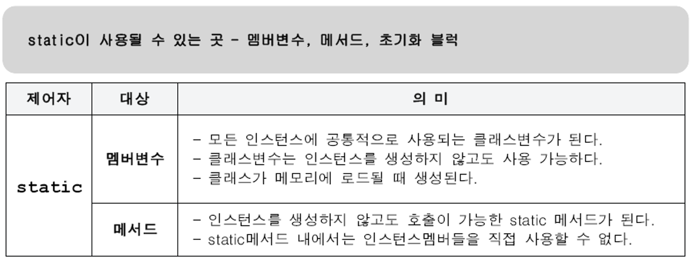
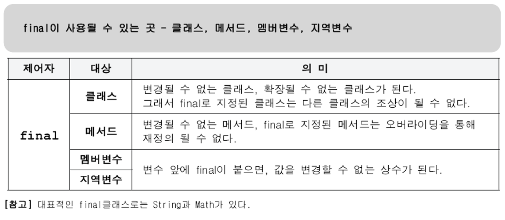
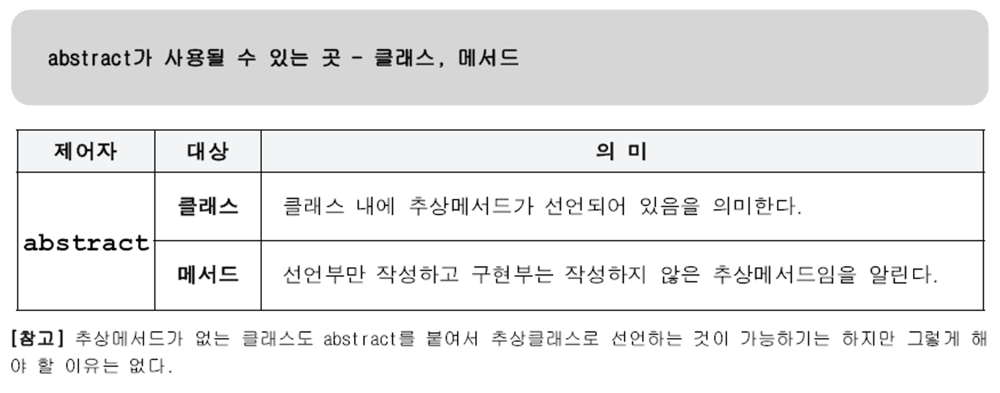
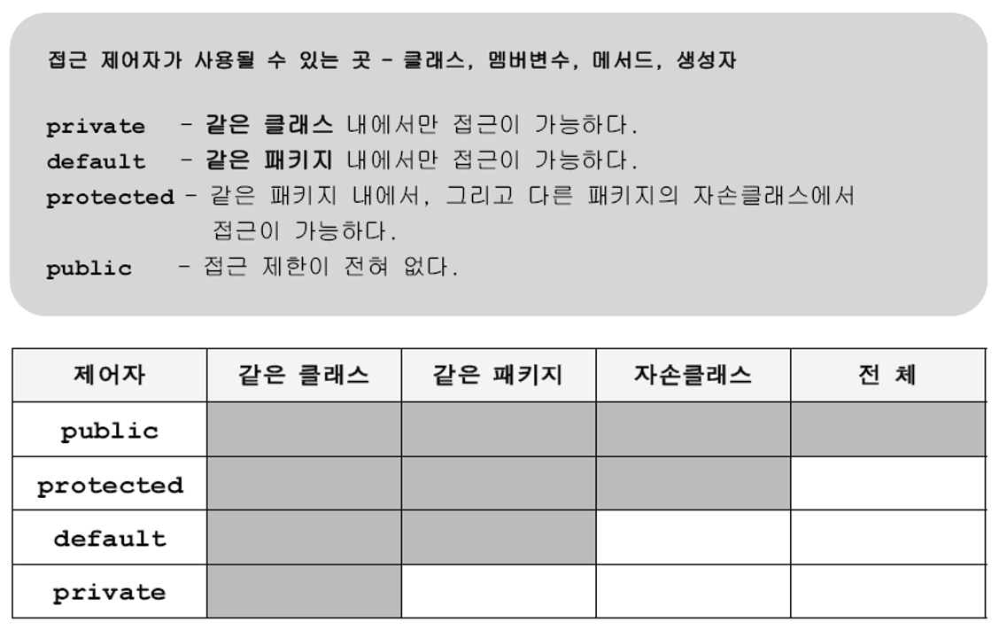

# 제어자(modifier)

## 제어자란?

* 제어자는 클래스, 변수 또는 메소드의 선언부에 함께 사용되어 부가적인 의미를 부여한다.
* 제어자의 종류는 크게 접근 제어자와 그 외의 제어자로 나눌 수 있다.
  * 접근 제어자 : public, protected, default, private
  * 그 외 : static, final, abstract, native, transient, synchronized, volatile, strictfp
* 하나의 대상에 대해서 여러 제어자를 조합하여 사용하는 것이 가능하다.
  * 제어자들 간의 순서는 관계없지만 주로 접근 제어자를 제일 왼쪽에 놓는 경향이 있다.
* 단, 접근 제어자는 한 번에 네 가지 중 하나만 선택해서 사용할 수 있다.

## static - 클래스의, 공통적인

* static은 '클래스의' 또는 '공통적인'의 의미를 가지고 있다.
* static이 붙은 멤버변수와 메소드, 그리고 초기화 블럭은 인스턴스가 아닌 클래스에 관계된 것이기 때문에  
  인스턴스를 생성하지 않고도 사용할 수 있다.
* 클래스 변수(static 멤버변수)는 하나의 변수를 모든 인스턴스가 공유하기 때문에 인스턴스에 관계없이 같은 값을 갖는다.
* 인스턴스 메소드와 static 메소드의 근본적인 차이는 메소드 내에서 인스턴스 멤버를 사용하는가의 여부에 있다.
* static 초기화 블럭은 클래스가 메모리에 로드될 때 단 한번만 수행되며, 주로 클래스 변수를 초기화하는데 사용된다.



```java
class StaticExample {
    static int cv = 1;                          // 클래스 변수(static 멤버변수)
    
    static {                                    // 클래스 초기화 블럭(static 초기화 블럭)
        // static 변수의 복잡한 초기화 수행
    }
    
    static int max(int a, int b) {              // 클래스 메소드(static 메소드)
        return a > b ? a : b;
    }
}
```

## final - 마지막의, 변경될 수 없는

* final은 '마지막의' 또는 '변경될 수 없는'의 의미를 가지고 있으며 거의 모든 대상에 사용될 수 있다.
* final 멤버변수
  * 단 한 번만 초기화를 할 수 있으며 초기화 이후에는 값을 변경할 수 없다.
  * 초기화를 하지 않으면 에러가 발생한다.
  * 초기화 방법 3가지
    * 명시적 초기화
    * 초기화 블럭
    * 생성자
* final 지역변수
  * 단 한 번만 초기화를 할 수 있으며 초기화 이후에는 값을 변경할 수 없다.
  * 초기화를 하지 않아도 에러가 발생하지 않는다.
  * 메소드 내에서 초기화한다.



```java
final class FinalExample {          // 조상이 될 수 없는 클래스
    final int MAX_SIZE = 10;        // 값을 변경할 수 없는 멤버변수(상수)
    
    final void getMaxSize() {       // 오버라이딩할 수 없는 메소드(변경불가)
        final int LV = MAX_SIZE;    // 값을 변경할 수 없는 지역변수(상수)
        return MAX_SIZE;
    }
}
```

* final class는 상속하지 못하므로 위 코드처럼 final method로 선언할 필요는 없다.

## abstract - 추상의, 미완성의

* abstract는 '미완성'의 의미를 가지고 있다.
* 메소드의 선언부만 작성하고 실제 수행내용은 구현하지 않은 추상 메소드를 선언하는데 사용된다
* 그리고 클래스에 사용되어 클래스 내에 추상 메소드가 존재한다는 것을 쉽게 알 수 있게 해준다.
* 추상 클래스는 아직 완성되지 않은 메소드가 존재하는 '미완성 설계도'이므로 인스턴스를 생성할 수 없다.



```java
abstract class AbstractExample {    // 추상 클래스(추상 메소드를 포함한 클래스)
    abstract void move();           // 추상 메소드(구현부가 없는 메소드)
}
```

* 꽤 드물지만 추상 메소드가 없는 클래스, 즉 완성된 클래스도 abstarct를 붙여서 추상 클래스로 만드는 경우도 있다.
* 예를 들어, java.awt.event.WindowAdapter는 아래와 같이 아무런 내용이 없는 메소드들만 정의되어 있다.

```java
public abstract class WindowAdapter implements WindowListener, WindowStateListener, WindowFocusListener {
    public void windowOpened(WindowEvent e) {}
    public void windowClosing(WindowEvent e) {}
    public void windowClosed(WindowEvent e) {}
    public void windowIconified(WindowEvent e) {}
    ...
}
```

* 이 클래스 자체로는 쓸모가 없지만, 다른 클래스가 이 클래스를 상속받아서 일부의 원하는 메소드만 오버라이딩해도 된다는 장점이 있다

## 접근 제어자(access modifier)

* 접근 제어자는 멤버 또는 클래스에 사용되어, 외부에서 접근하지 못하도록 제한하는 역할을 한다.
* 접근 제어자 default는 실제로 default를 붙이지 않고 아무런 접근 제어자를 붙이지 않는 것을 의미한다.



|대 상|사용가능한 접근 제어자|
|:---:|---|
|클래스|public, (default)|
|메소드|public, protected, (default), private|
|멤버변수|public, protected, (default), private|
|지역변수|없음|

### 접근 제어자를 사용하는 이유 - 접근 제어자를 이용한 캡슐화(encapsulation)

* #### 클래스 내부에 선언된 데이터를 외부로부터 보호하기 위해서
  * 데이터가 유효한 값을 유지하도록, 또는 외부에서 데이터를 함부로 변경하지 못하도록 하기위해서는  
    외부로부터의 접근을 제한하는 것이 필요하다.
  * 이것을 데이터 감추기(data hiding)라고 하며, 객체지향개념의 캡슐화(encapsulation)에 해당하는 내용이다.
* #### 외부에는 불필요한, 내부적으로만 사용되는 부분을 감추기 위해서
  * 클래스 내에서만 사용되는, 내부 작업을 위해 임시로 사용도는 멤버변수나 부분작업을 처리하기 위한  
    메소드 등의 멤버들을 클래스 내부에 감추기 위해서이다.
  * 외부에서 접근할 필요가 없는 멤버들을 private로 지정하여 외부에 노출시키지 않음으로써 복잡성을 줄일 수 있다.  
    이 것 역시 캡슐화에 해당한다.
* #### 유지보수의 용이성
  * 만일 메소드 하나를 변경해야 한다고 가정했을 때, 이 메소드의 접근 제어자가 public이라면,  
    메소드를 변경한 후에 오류가 없는지 테스트해야하는 범위가 넓다.
  * 그러나 접근 제어자가 default라면 패키지 내부만 확인해 보면 되고, private이면 클래스 하나만 살펴보면 된다.

### 생성자의 접근 제어자

* 생성자에 접근 제어자를 사용함으로써 인스턴스의 생성을 제한할 수 있다.
* 보통 생성자의 접근 제어자는 클래스의 접근 제어자와 같지만, 다르게 지정할 수도 있다.
* 생성자의 접근 제어자를 private로 지정하면, 외부에서 생성자에 접근할 수 없으므로 인스턴스를 생성할 수 없게 된다.
* 그래도 클래스 내부에서는 인스턴스를 생성할 수 있다.
* 인스턴스를 반환해주는 public static 메소드를 제공함으로써 외부에서 이 클래스의 인스턴스를 사용하도록 할 수 있다.

```java
final class Singleton {
    priavte static Singleton s = new Singleton();
    
    private Singleton() {}
    
    public static Singleton getInstance() {
        return s;
    }
}

class SingletonExample {
    public static void main(String[] args) {
        Singleton s = Singleton.getInstance();
    }
}
```
* 생성자를 통해 직접 인스턴스를 생성하지 못하게 하고 public static 메소드를 통해 인스턴스에 접근하게 함으로써  
  사용할 수 있는 인스턴스의 개수를 제한할 수 있다.
* 생성자가 private인 클래스는 다른 클래스의 조상이 될 수 없다.
  * 자손 클래스의 인스턴스를 생성할 때 조상 클래스의 생성자를 호출해야만 하는데,  
    생성자의 접근 제어자가 private 이므로 자손 클래스에서 호출하는 것이 불가능하기 때문이다.
  * 그래서 클래스 앞에 final을 추가하여 상속할 수 없는 클래스라는 것을 알리는 것이 좋다.
    * Math 클래스는 몇 개의 상수와 static 메소드만으로 구성되어 있기 때문에 인스턴스를 생성할 필요가 없다.
    * 그래서 외부로부터의 불필요한 접근을 막기 위해 생성자의 접근 제어자를 private로 지정하였다.
      ```java
      public final class Math {
          private Math() {}
      }
      ```

## 제어자(modifier)의 조합

|대 상|사용가능한 제어자|
|:---:|---|
|클래스|public, (default), final, abstract|
|메소드|모든 접근 제어자, final, abstract, static|
|멤버변수|모든 접근 제어자, final, static|
|지역변수|final|

* **메소드에 static과 abstract를 함께 사용할 수 없다.**
  * static 메소드는 구현부가 있는 메소드에만 사용할 수 있기 때문이다.
* **클래스에 abstract와 final을 동시에 사용할 수없다.**
  * 클래스에 사용되는 final은 클래스를 확장할 수 없다는 의미이고 abstract는 상속을 통해서 완성되어야 한다는 의미이므로  
    서로 모순되기 때문이다.
* **abstract 메소드의 접근 제어자가 private일 수 없다.**
  * abstract 메소드는 자손 클래스에서 구현해주어야 하는데 접근 제어자가 private이면,  
    자손 클래스에서 접근할 수 없기 때문이다.
* **메소드에 private와 final을 같이 사용할 필요는 없다.**
  * 접근 제어자가 private인 메소드는 오버라이딩될 수 없기 때문이다. 둘 중 하나만 사용해도 의미가 충분하다.

# 참고

* [자바의 정석](http://www.kyobobook.co.kr/product/detailViewKor.laf?ejkGb=KOR&mallGb=KOR&barcode=9788994492032&orderClick=LAG&Kc=)
